# Дипломный практикум в Yandex.Cloud
  * [Цели:](#цели)
  * [Этапы выполнения:](#этапы-выполнения)
     * [Создание облачной инфраструктуры](#создание-облачной-инфраструктуры)
     * [Создание Kubernetes кластера](#создание-kubernetes-кластера)
     * [Создание тестового приложения](#создание-тестового-приложения)
     * [Подготовка cистемы мониторинга и деплой приложения](#подготовка-cистемы-мониторинга-и-деплой-приложения)
     * [Установка и настройка CI/CD](#установка-и-настройка-cicd)
  * [Что необходимо для сдачи задания?](#что-необходимо-для-сдачи-задания)
  * [Как правильно задавать вопросы дипломному руководителю?](#как-правильно-задавать-вопросы-дипломному-руководителю)

**Перед началом работы над дипломным заданием изучите [Инструкция по экономии облачных ресурсов](https://github.com/netology-code/devops-materials/blob/master/cloudwork.MD).**

---
## Цели:

1. Подготовить облачную инфраструктуру на базе облачного провайдера Яндекс.Облако.
2. Запустить и сконфигурировать Kubernetes кластер.
3. Установить и настроить систему мониторинга.
4. Настроить и автоматизировать сборку тестового приложения с использованием Docker-контейнеров.
5. Настроить CI для автоматической сборки и тестирования.
6. Настроить CD для автоматического развёртывания приложения.

---
## Этапы выполнения:


### Создание облачной инфраструктуры

Для начала необходимо подготовить облачную инфраструктуру в ЯО при помощи [Terraform](https://www.terraform.io/).

Особенности выполнения:

- Бюджет купона ограничен, что следует иметь в виду при проектировании инфраструктуры и использовании ресурсов;
Для облачного k8s используйте региональный мастер(неотказоустойчивый). Для self-hosted k8s минимизируйте ресурсы ВМ и долю ЦПУ. В обоих вариантах используйте прерываемые ВМ для worker nodes.
- Следует использовать версию [Terraform](https://www.terraform.io/) не старше 1.5.x .

Предварительная подготовка к установке и запуску Kubernetes кластера.

1. Создайте сервисный аккаунт, который будет в дальнейшем использоваться Terraform для работы с инфраструктурой с необходимыми и достаточными правами. Не стоит использовать права суперпользователя
2. Подготовьте [backend](https://www.terraform.io/docs/language/settings/backends/index.html) для Terraform:  
   а. Рекомендуемый вариант: S3 bucket в созданном ЯО аккаунте(создание бакета через TF)
   б. Альтернативный вариант:  [Terraform Cloud](https://app.terraform.io/)  
3. Создайте VPC с подсетями в разных зонах доступности.
4. Убедитесь, что теперь вы можете выполнить команды `terraform destroy` и `terraform apply` без дополнительных ручных действий.
5. В случае использования [Terraform Cloud](https://app.terraform.io/) в качестве [backend](https://www.terraform.io/docs/language/settings/backends/index.html) убедитесь, что применение изменений успешно проходит, используя web-интерфейс Terraform cloud.

Ожидаемые результаты:

1. Terraform сконфигурирован и создание инфраструктуры посредством Terraform возможно без дополнительных ручных действий.
2. Полученная конфигурация инфраструктуры является предварительной, поэтому в ходе дальнейшего выполнения задания возможны изменения.
---

### Решение

Подготовил backend для Terraform: Выбрал альтернативный вариант: S3 bucket в созданном ЯО аккаунте.

1. Создал сервисные аккаунты (stage и prod, для работы в соовтетствущих каталогах), которые будут в дальнейшем использоваться Terraform для работы с инфраструктурой с необходимыми и достаточными правами.
Также сгенерировал для каждого аккаунта ключ и положил в каталог для развертывания инфраструктуры.

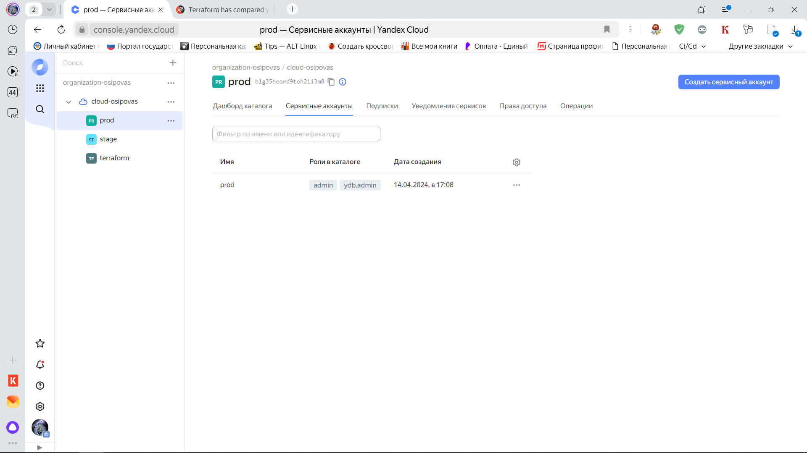

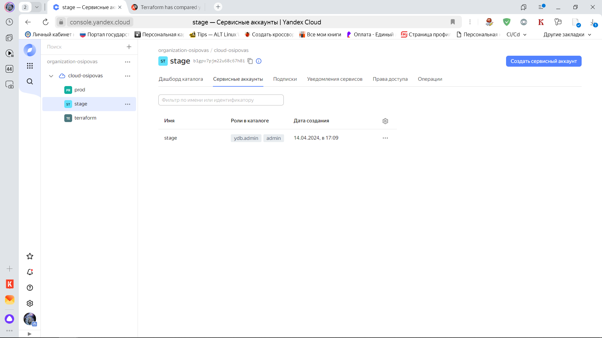

2. Подготовил backend для Terraform: Выбрал альтернативный вариант: S3 bucket в созданном ЯО аккаунте.

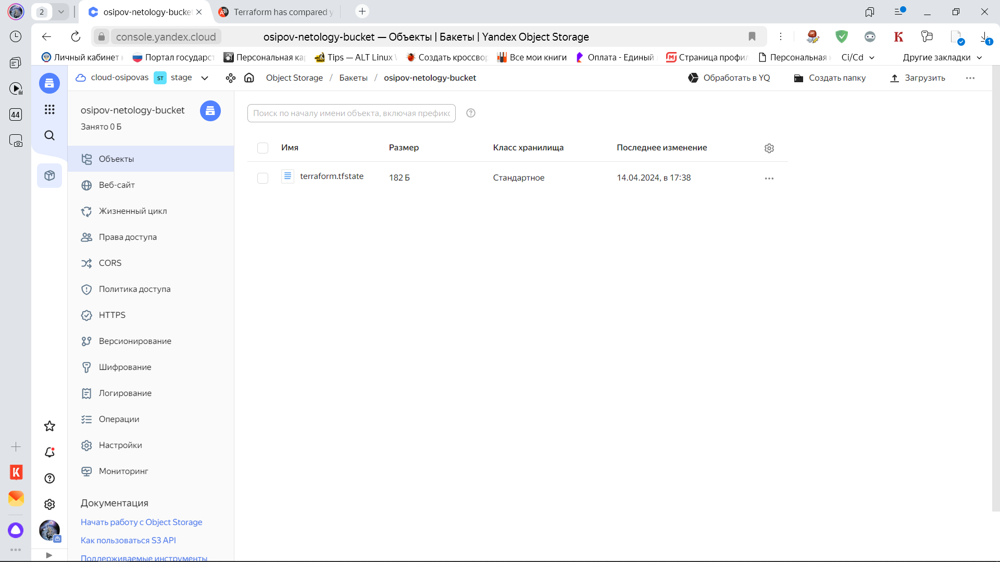

<details>
<summary>Развертывание bucket</summary>

```commandline
alex@DESKTOP-SOTHBR6:/mnt/e/wsl/diplom/stage/bucket$ terraform apply -auto-approve

Terraform used the selected providers to generate the following execution plan. Resource actions
are indicated with the following symbols:
  + create

Terraform will perform the following actions:

  # local_file.backendConf will be created
  + resource "local_file" "backendConf" {
      + content              = (sensitive value)
      + content_base64sha256 = (known after apply)
      + content_base64sha512 = (known after apply)
      + content_md5          = (known after apply)
      + content_sha1         = (known after apply)
      + content_sha256       = (known after apply)
      + content_sha512       = (known after apply)
      + directory_permission = "0777"
      + file_permission      = "0777"
      + filename             = "../backend.key"
      + id                   = (known after apply)
    }

  # yandex_iam_service_account.sa-terraform will be created
  + resource "yandex_iam_service_account" "sa-terraform" {
      + created_at = (known after apply)
      + folder_id  = (known after apply)
      + id         = (known after apply)
      + name       = "sa-terraform"
    }

  # yandex_iam_service_account_static_access_key.sa-static-key will be created
  + resource "yandex_iam_service_account_static_access_key" "sa-static-key" {
      + access_key           = (known after apply)
      + created_at           = (known after apply)
      + description          = "static access key"
      + encrypted_secret_key = (known after apply)
      + id                   = (known after apply)
      + key_fingerprint      = (known after apply)
      + secret_key           = (sensitive value)
      + service_account_id   = (known after apply)
    }

  # yandex_resourcemanager_folder_iam_member.terraform-editor will be created
  + resource "yandex_resourcemanager_folder_iam_member" "terraform-editor" {
      + folder_id = "b1gpv7pjm22u68c67h8i"
      + id        = (known after apply)
      + member    = (known after apply)
      + role      = "editor"
    }

  # yandex_storage_bucket.netology-bucket will be created
  + resource "yandex_storage_bucket" "netology-bucket" {
      + access_key            = (known after apply)
      + acl                   = "private"
      + bucket                = "osipov-netology-bucket"
      + bucket_domain_name    = (known after apply)
      + default_storage_class = (known after apply)
      + folder_id             = (known after apply)
      + force_destroy         = true
      + id                    = (known after apply)
      + secret_key            = (sensitive value)
      + website_domain        = (known after apply)
      + website_endpoint      = (known after apply)
    }

  # yandex_storage_object.object-1 will be created
  + resource "yandex_storage_object" "object-1" {
      + access_key   = (known after apply)
      + acl          = "private"
      + bucket       = "osipov-netology-bucket"
      + content_type = (known after apply)
      + id           = (known after apply)
      + key          = "terraform.tfstate"
      + secret_key   = (sensitive value)
      + source       = "../terraform.tfstate"
    }

Plan: 6 to add, 0 to change, 0 to destroy.
yandex_iam_service_account.sa-terraform: Creating...
yandex_iam_service_account.sa-terraform: Creation complete after 3s [id=aje72mlt2dc4dmvoo5t6]
yandex_resourcemanager_folder_iam_member.terraform-editor: Creating...
yandex_iam_service_account_static_access_key.sa-static-key: Creating...
yandex_iam_service_account_static_access_key.sa-static-key: Creation complete after 2s [id=aje7haaoil82524v9u4u]
yandex_storage_bucket.netology-bucket: Creating...
yandex_resourcemanager_folder_iam_member.terraform-editor: Creation complete after 3s [id=b1gpv7pjm22u68c67h8i/editor/serviceAccount:aje72mlt2dc4dmvoo5t6]
yandex_storage_bucket.netology-bucket: Creation complete after 3s [id=osipov-netology-bucket]
yandex_storage_object.object-1: Creating...
local_file.backendConf: Creating...
local_file.backendConf: Creation complete after 0s [id=8ddb43832e3c8f186e58778d05925f0b47122a2b]
yandex_storage_object.object-1: Creation complete after 1s [id=terraform.tfstate]

Apply complete! Resources: 6 added, 0 changed, 0 destroyed.
```

</details>

3. Настроил workspaces. Выбрал рекомендуемый вариант: создал два workspace: stage и prod.

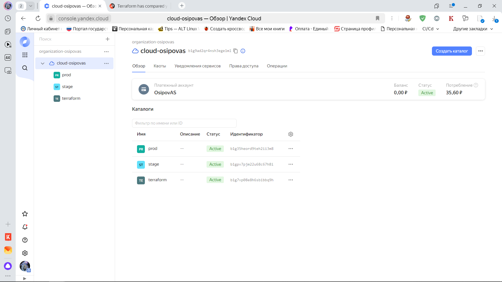


4. Создал VPC с подсетями в разных зонах доступности.

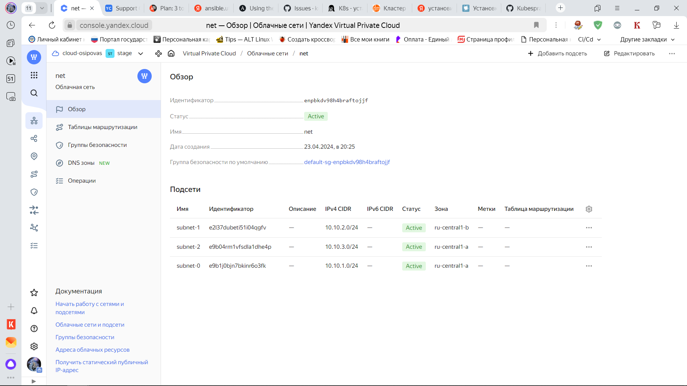

5. Terraform сконфигурирован и создание инфраструктуры посредством Terraform возможно без дополнительных ручных действий.

Пробовал ноды создать в зонах С и D, но вышла ошибка квоты в этих зонах, поэтому создал только в А и В. В итоге стокнулся с проблемой четного количества нод. Исправил конфиг на создание нод в зоне А и Б 

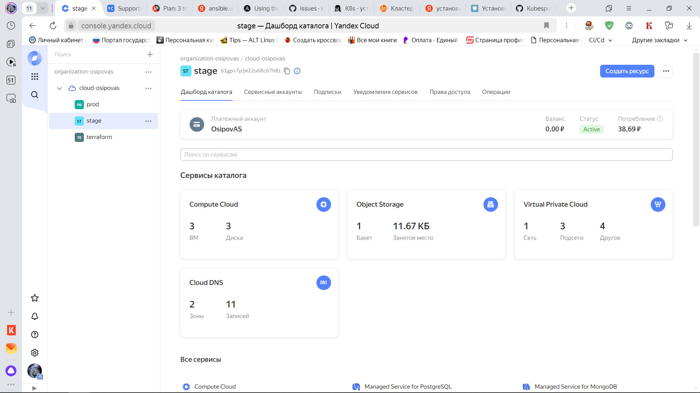

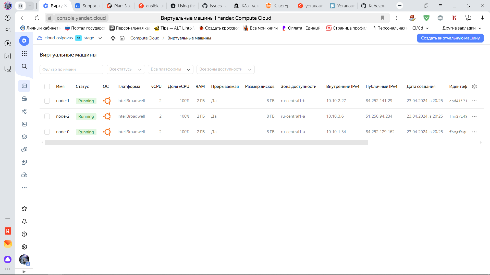

Инфраструктура развернулась и удалилась в автоматизированном режиме.

<details>
<summary>Развертывание инфраструктуры</summary>

```commandline
alex@DESKTOP-SOTHBR6:/mnt/e/wsl/diplom/stage$ terraform apply -auto-approve
yandex_vpc_network.subnet-zones: Refreshing state... [id=enpbkdv98h4braftojjf]
yandex_vpc_subnet.subnet-zones[1]: Refreshing state... [id=e2l37dubeti51i04qgfv]
yandex_vpc_subnet.subnet-zones[2]: Refreshing state... [id=e9b04rm1vfsdla1dhe4p]
yandex_vpc_subnet.subnet-zones[0]: Refreshing state... [id=e9b1j0bjn7bkinr6o3fk]
yandex_compute_instance.cluster-k8s[0]: Refreshing state... [id=fhmgfequn5pue1kn1vdj]
yandex_compute_instance.cluster-k8s[2]: Refreshing state... [id=fhm27l49envlauv68dcq]
yandex_compute_instance.cluster-k8s[1]: Refreshing state... [id=epd41i713bgm3om72vvm]

Note: Objects have changed outside of Terraform

Terraform detected the following changes made outside of Terraform since the last "terraform apply" which may have
affected this plan:

  # yandex_vpc_network.subnet-zones has been deleted
  - resource "yandex_vpc_network" "subnet-zones" {
      - id                        = "enpbkdv98h4braftojjf" -> null
        name                      = "net"
        # (6 unchanged attributes hidden)
    }


Unless you have made equivalent changes to your configuration, or ignored the relevant attributes using ignore_changes,
the following plan may include actions to undo or respond to these changes.

───────────────────────────────────────────────────────────────────────────────────────────────────────────────────────

Terraform used the selected providers to generate the following execution plan. Resource actions are indicated with the
following symbols:
  + create

Terraform will perform the following actions:

  # yandex_compute_instance.cluster-k8s[0] will be created
  + resource "yandex_compute_instance" "cluster-k8s" {
      + allow_stopping_for_update = true
      + created_at                = (known after apply)
      + folder_id                 = (known after apply)
      + fqdn                      = (known after apply)
      + gpu_cluster_id            = (known after apply)
      + hostname                  = "node-0"
      + id                        = (known after apply)
      + labels                    = {
          + "index" = "0"
        }
      + maintenance_grace_period  = (known after apply)
      + maintenance_policy        = (known after apply)
      + metadata                  = {
          + "ssh-keys" = <<-EOT
                ubuntu:ssh-rsa AAAAB3NzaC1yc2EAAAADAQABAAABgQDR3XW9AeXsEqCCp8mVItD4avsHRVEuBGCuoqWOAZaffz/HObt7XBlD1oDE5LdihAdD3jOGLfUpxrOhQidNuknPHKzKmgwA3xUuwFIg/W4G/s4LAzGwfjr/PIdI6//ZH/iBQaa+sWINi19PpQNY4GRmWEHhqmg0gzhiaat+RczNzrLn6ObbMItcWo/wOazL0Kja0VnfNum5LUOD33O/z/D059Z8/RFcQSExvoh5uyRbUJBAoD96OdJW5jeRbr7b9G+jHVoSGwozdPNXxYe7rFNLM8JDbFH/Ymhup/nFkEQVyXM3tJE30knYJh/TFLAonWMYId3ODCFwfR93CKcvM1kiWLvAQBqaIVnRjcKUTUxJUUvIVg6BmvYVqGVmmGQfN+qHHHOWRsXKBgN1ADu3/cbxINtghqNCUQKrAgHQEATrf2P87R0OE3RJt2CzAZyaIYFiHBrNmsgvNIGn2T7lncqTK6Tl3llBbNPs9pzqai3osSd1+Jc1jo0HjVh3j4/CJuE= alex@DESKTOP-SOTHBR6
            EOT
        }
      + name                      = "node-0"
      + network_acceleration_type = "standard"
      + platform_id               = "standard-v1"
      + service_account_id        = (known after apply)
      + status                    = (known after apply)
      + zone                      = "ru-central1-a"

      + boot_disk {
          + auto_delete = true
          + device_name = (known after apply)
          + disk_id     = (known after apply)
          + mode        = (known after apply)

          + initialize_params {
              + block_size  = (known after apply)
              + description = (known after apply)
              + image_id    = "fd852pbtueis1q0pbt4o"
              + name        = (known after apply)
              + size        = 8
              + snapshot_id = (known after apply)
              + type        = "network-hdd"
            }
        }

      + network_interface {
          + index              = (known after apply)
          + ip_address         = (known after apply)
          + ipv4               = true
          + ipv6               = (known after apply)
          + ipv6_address       = (known after apply)
          + mac_address        = (known after apply)
          + nat                = true
          + nat_ip_address     = (known after apply)
          + nat_ip_version     = (known after apply)
          + security_group_ids = (known after apply)
          + subnet_id          = (known after apply)
        }

      + resources {
          + core_fraction = 100
          + cores         = 2
          + memory        = 2
        }

      + scheduling_policy {
          + preemptible = true
        }
    }

  # yandex_compute_instance.cluster-k8s[1] will be created
  + resource "yandex_compute_instance" "cluster-k8s" {
      + allow_stopping_for_update = true
      + created_at                = (known after apply)
      + folder_id                 = (known after apply)
      + fqdn                      = (known after apply)
      + gpu_cluster_id            = (known after apply)
      + hostname                  = "node-1"
      + id                        = (known after apply)
      + labels                    = {
          + "index" = "1"
        }
      + maintenance_grace_period  = (known after apply)
      + maintenance_policy        = (known after apply)
      + metadata                  = {
          + "ssh-keys" = <<-EOT
                ubuntu:ssh-rsa AAAAB3NzaC1yc2EAAAADAQABAAABgQDR3XW9AeXsEqCCp8mVItD4avsHRVEuBGCuoqWOAZaffz/HObt7XBlD1oDE5LdihAdD3jOGLfUpxrOhQidNuknPHKzKmgwA3xUuwFIg/W4G/s4LAzGwfjr/PIdI6//ZH/iBQaa+sWINi19PpQNY4GRmWEHhqmg0gzhiaat+RczNzrLn6ObbMItcWo/wOazL0Kja0VnfNum5LUOD33O/z/D059Z8/RFcQSExvoh5uyRbUJBAoD96OdJW5jeRbr7b9G+jHVoSGwozdPNXxYe7rFNLM8JDbFH/Ymhup/nFkEQVyXM3tJE30knYJh/TFLAonWMYId3ODCFwfR93CKcvM1kiWLvAQBqaIVnRjcKUTUxJUUvIVg6BmvYVqGVmmGQfN+qHHHOWRsXKBgN1ADu3/cbxINtghqNCUQKrAgHQEATrf2P87R0OE3RJt2CzAZyaIYFiHBrNmsgvNIGn2T7lncqTK6Tl3llBbNPs9pzqai3osSd1+Jc1jo0HjVh3j4/CJuE= alex@DESKTOP-SOTHBR6
            EOT
        }
      + name                      = "node-1"
      + network_acceleration_type = "standard"
      + platform_id               = "standard-v1"
      + service_account_id        = (known after apply)
      + status                    = (known after apply)
      + zone                      = "ru-central1-b"

      + boot_disk {
          + auto_delete = true
          + device_name = (known after apply)
          + disk_id     = (known after apply)
          + mode        = (known after apply)

          + initialize_params {
              + block_size  = (known after apply)
              + description = (known after apply)
              + image_id    = "fd852pbtueis1q0pbt4o"
              + name        = (known after apply)
              + size        = 8
              + snapshot_id = (known after apply)
              + type        = "network-hdd"
            }
        }

      + network_interface {
          + index              = (known after apply)
          + ip_address         = (known after apply)
          + ipv4               = true
          + ipv6               = (known after apply)
          + ipv6_address       = (known after apply)
          + mac_address        = (known after apply)
          + nat                = true
          + nat_ip_address     = (known after apply)
          + nat_ip_version     = (known after apply)
          + security_group_ids = (known after apply)
          + subnet_id          = (known after apply)
        }

      + resources {
          + core_fraction = 100
          + cores         = 2
          + memory        = 2
        }

      + scheduling_policy {
          + preemptible = true
        }
    }

  # yandex_compute_instance.cluster-k8s[2] will be created
  + resource "yandex_compute_instance" "cluster-k8s" {
      + allow_stopping_for_update = true
      + created_at                = (known after apply)
      + folder_id                 = (known after apply)
      + fqdn                      = (known after apply)
      + gpu_cluster_id            = (known after apply)
      + hostname                  = "node-2"
      + id                        = (known after apply)
      + labels                    = {
          + "index" = "2"
        }
      + maintenance_grace_period  = (known after apply)
      + maintenance_policy        = (known after apply)
      + metadata                  = {
          + "ssh-keys" = <<-EOT
                ubuntu:ssh-rsa AAAAB3NzaC1yc2EAAAADAQABAAABgQDR3XW9AeXsEqCCp8mVItD4avsHRVEuBGCuoqWOAZaffz/HObt7XBlD1oDE5LdihAdD3jOGLfUpxrOhQidNuknPHKzKmgwA3xUuwFIg/W4G/s4LAzGwfjr/PIdI6//ZH/iBQaa+sWINi19PpQNY4GRmWEHhqmg0gzhiaat+RczNzrLn6ObbMItcWo/wOazL0Kja0VnfNum5LUOD33O/z/D059Z8/RFcQSExvoh5uyRbUJBAoD96OdJW5jeRbr7b9G+jHVoSGwozdPNXxYe7rFNLM8JDbFH/Ymhup/nFkEQVyXM3tJE30knYJh/TFLAonWMYId3ODCFwfR93CKcvM1kiWLvAQBqaIVnRjcKUTUxJUUvIVg6BmvYVqGVmmGQfN+qHHHOWRsXKBgN1ADu3/cbxINtghqNCUQKrAgHQEATrf2P87R0OE3RJt2CzAZyaIYFiHBrNmsgvNIGn2T7lncqTK6Tl3llBbNPs9pzqai3osSd1+Jc1jo0HjVh3j4/CJuE= alex@DESKTOP-SOTHBR6
            EOT
        }
      + name                      = "node-2"
      + network_acceleration_type = "standard"
      + platform_id               = "standard-v1"
      + service_account_id        = (known after apply)
      + status                    = (known after apply)
      + zone                      = "ru-central1-a"

      + boot_disk {
          + auto_delete = true
          + device_name = (known after apply)
          + disk_id     = (known after apply)
          + mode        = (known after apply)

          + initialize_params {
              + block_size  = (known after apply)
              + description = (known after apply)
              + image_id    = "fd852pbtueis1q0pbt4o"
              + name        = (known after apply)
              + size        = 8
              + snapshot_id = (known after apply)
              + type        = "network-hdd"
            }
        }

      + network_interface {
          + index              = (known after apply)
          + ip_address         = (known after apply)
          + ipv4               = true
          + ipv6               = (known after apply)
          + ipv6_address       = (known after apply)
          + mac_address        = (known after apply)
          + nat                = true
          + nat_ip_address     = (known after apply)
          + nat_ip_version     = (known after apply)
          + security_group_ids = (known after apply)
          + subnet_id          = (known after apply)
        }

      + resources {
          + core_fraction = 100
          + cores         = 2
          + memory        = 2
        }

      + scheduling_policy {
          + preemptible = true
        }
    }

  # yandex_vpc_network.subnet-zones will be created
  + resource "yandex_vpc_network" "subnet-zones" {
      + created_at                = (known after apply)
      + default_security_group_id = (known after apply)
      + folder_id                 = (known after apply)
      + id                        = (known after apply)
      + labels                    = (known after apply)
      + name                      = "net"
      + subnet_ids                = (known after apply)
    }

  # yandex_vpc_subnet.subnet-zones[0] will be created
  + resource "yandex_vpc_subnet" "subnet-zones" {
      + created_at     = (known after apply)
      + folder_id      = (known after apply)
      + id             = (known after apply)
      + labels         = (known after apply)
      + name           = "subnet-0"
      + network_id     = (known after apply)
      + v4_cidr_blocks = [
          + "10.10.1.0/24",
        ]
      + v6_cidr_blocks = (known after apply)
      + zone           = "ru-central1-a"
    }

  # yandex_vpc_subnet.subnet-zones[1] will be created
  + resource "yandex_vpc_subnet" "subnet-zones" {
      + created_at     = (known after apply)
      + folder_id      = (known after apply)
      + id             = (known after apply)
      + labels         = (known after apply)
      + name           = "subnet-1"
      + network_id     = (known after apply)
      + v4_cidr_blocks = [
          + "10.10.2.0/24",
        ]
      + v6_cidr_blocks = (known after apply)
      + zone           = "ru-central1-b"
    }

  # yandex_vpc_subnet.subnet-zones[2] will be created
  + resource "yandex_vpc_subnet" "subnet-zones" {
      + created_at     = (known after apply)
      + folder_id      = (known after apply)
      + id             = (known after apply)
      + labels         = (known after apply)
      + name           = "subnet-2"
      + network_id     = (known after apply)
      + v4_cidr_blocks = [
          + "10.10.3.0/24",
        ]
      + v6_cidr_blocks = (known after apply)
      + zone           = "ru-central1-a"
    }

Plan: 7 to add, 0 to change, 0 to destroy.

Changes to Outputs:
  ~ external_ip_address_nodes = {
      ~ node-0 = "84.252.129.162" -> (known after apply)
      ~ node-1 = "84.252.141.29" -> (known after apply)
      ~ node-2 = "51.250.94.234" -> (known after apply)
    }
  ~ internal_ip_address_nodes = {
      ~ node-0 = "10.10.1.34" -> (known after apply)
      ~ node-1 = "10.10.2.27" -> (known after apply)
      ~ node-2 = "10.10.3.6" -> (known after apply)
    }
yandex_vpc_network.subnet-zones: Creating...
yandex_vpc_network.subnet-zones: Creation complete after 2s [id=enpmgjdhicconpcmkru2]
yandex_vpc_subnet.subnet-zones[2]: Creating...
yandex_vpc_subnet.subnet-zones[0]: Creating...
yandex_vpc_subnet.subnet-zones[1]: Creating...
yandex_vpc_subnet.subnet-zones[1]: Creation complete after 0s [id=e2lp6ge60ve1m7cprhgn]
yandex_vpc_subnet.subnet-zones[2]: Creation complete after 1s [id=e9b3jsh9b2cfafpt8qfd]
yandex_vpc_subnet.subnet-zones[0]: Creation complete after 2s [id=e9bhdoo0g39kp9nqjn7f]
yandex_compute_instance.cluster-k8s[2]: Creating...
yandex_compute_instance.cluster-k8s[0]: Creating...
yandex_compute_instance.cluster-k8s[1]: Creating...
yandex_compute_instance.cluster-k8s[1]: Still creating... [10s elapsed]
yandex_compute_instance.cluster-k8s[0]: Still creating... [10s elapsed]
yandex_compute_instance.cluster-k8s[2]: Still creating... [10s elapsed]
yandex_compute_instance.cluster-k8s[2]: Still creating... [20s elapsed]
yandex_compute_instance.cluster-k8s[1]: Still creating... [20s elapsed]
yandex_compute_instance.cluster-k8s[0]: Still creating... [20s elapsed]
yandex_compute_instance.cluster-k8s[1]: Still creating... [31s elapsed]
yandex_compute_instance.cluster-k8s[0]: Still creating... [31s elapsed]
yandex_compute_instance.cluster-k8s[2]: Still creating... [31s elapsed]
yandex_compute_instance.cluster-k8s[1]: Creation complete after 34s [id=epdhslpl5bilr4fitk7q]
yandex_compute_instance.cluster-k8s[0]: Creation complete after 35s [id=fhmdre8vv0k9ag6u8ru1]
yandex_compute_instance.cluster-k8s[2]: Still creating... [41s elapsed]
yandex_compute_instance.cluster-k8s[2]: Creation complete after 48s [id=fhmu0prqbljno3pr2qvk]

Apply complete! Resources: 7 added, 0 changed, 0 destroyed.

Outputs:

external_ip_address_nodes = {
  "node-0" = "158.160.117.146"
  "node-1" = "158.160.88.107"
  "node-2" = "178.154.203.169"
}
internal_ip_address_nodes = {
  "node-0" = "10.10.1.30"
  "node-1" = "10.10.2.29"
  "node-2" = "10.10.3.30"
}
```

</details>

<details>
<summary>Удаление инфраструктуры</summary>

```commandline
alex@DESKTOP-SOTHBR6:/mnt/e/wsl/diplom/stage$ terraform destory -auto-approve
Terraform has no command named "destory". Did you mean "destroy"?

To see all of Terraform's top-level commands, run:
  terraform -help

alex@DESKTOP-SOTHBR6:/mnt/e/wsl/diplom/stage$ terraform destroy -auto-approve
yandex_vpc_network.subnet-zones: Refreshing state... [id=enphjhfk92o7jf91jqeo]
yandex_vpc_subnet.subnet-zones[0]: Refreshing state... [id=e9bjh19tuljaljvja4kc]
yandex_vpc_subnet.subnet-zones[1]: Refreshing state... [id=e2lsqds1ioisf55ve7a4]
yandex_compute_instance.cluster-k8s[1]: Refreshing state... [id=epdl27rm6ik91grdtk83]
yandex_compute_instance.cluster-k8s[0]: Refreshing state... [id=fhmqnbptk29g4ditim72]

Terraform used the selected providers to generate the following execution plan. Resource actions
are indicated with the following symbols:
  - destroy

Terraform will perform the following actions:

  # yandex_compute_instance.cluster-k8s[0] will be destroyed
  - resource "yandex_compute_instance" "cluster-k8s" {
      - allow_stopping_for_update = true -> null
      - created_at                = "2024-04-14T12:21:16Z" -> null
      - folder_id                 = "b1gpv7pjm22u68c67h8i" -> null
      - fqdn                      = "node-0.ru-central1.internal" -> null
      - hostname                  = "node-0" -> null
      - id                        = "fhmqnbptk29g4ditim72" -> null
      - labels                    = {
          - "index" = "0"
        } -> null
      - metadata                  = {
          - "ssh-keys" = <<-EOT
                ubuntu:ssh-rsa AAAAB3NzaC1yc2EAAAADAQABAAABgQDR3XW9AeXsEqCCp8mVItD4avsHRVEuBGCuoqWOAZaffz/HObt7XBlD1oDE5LdihAdD3jOGLfUpxrOhQidNuknPHKzKmgwA3xUuwFIg/W4G/s4LAzGwfjr/PIdI6//ZH/iBQaa+sWINi19PpQNY4GRmWEHhqmg0gzhiaat+RczNzrLn6ObbMItcWo/wOazL0Kja0VnfNum5LUOD33O/z/D059Z8/RFcQSExvoh5uyRbUJBAoD96OdJW5jeRbr7b9G+jHVoSGwozdPNXxYe7rFNLM8JDbFH/Ymhup/nFkEQVyXM3tJE30knYJh/TFLAonWMYId3ODCFwfR93CKcvM1kiWLvAQBqaIVnRjcKUTUxJUUvIVg6BmvYVqGVmmGQfN+qHHHOWRsXKBgN1ADu3/cbxINtghqNCUQKrAgHQEATrf2P87R0OE3RJt2CzAZyaIYFiHBrNmsgvNIGn2T7lncqTK6Tl3llBbNPs9pzqai3osSd1+Jc1jo0HjVh3j4/CJuE= alex@DESKTOP-SOTHBR6
            EOT
        } -> null
      - name                      = "node-0" -> null
      - network_acceleration_type = "standard" -> null
      - platform_id               = "standard-v1" -> null
      - status                    = "running" -> null
      - zone                      = "ru-central1-a" -> null
        # (4 unchanged attributes hidden)

      - boot_disk {
          - auto_delete = true -> null
          - device_name = "fhm3sr3b7jb91v4meinl" -> null
          - disk_id     = "fhm3sr3b7jb91v4meinl" -> null
          - mode        = "READ_WRITE" -> null

          - initialize_params {
              - block_size  = 4096 -> null
              - image_id    = "fd852pbtueis1q0pbt4o" -> null
                name        = null
              - size        = 8 -> null
              - type        = "network-hdd" -> null
                # (2 unchanged attributes hidden)
            }
        }

      - metadata_options {
          - aws_v1_http_endpoint = 1 -> null
          - aws_v1_http_token    = 2 -> null
          - gce_http_endpoint    = 1 -> null
          - gce_http_token       = 1 -> null
        }

      - network_interface {
          - index              = 0 -> null
          - ip_address         = "10.10.1.23" -> null
          - ipv4               = true -> null
          - ipv6               = false -> null
          - mac_address        = "d0:0d:1a:ba:f3:da" -> null
          - nat                = true -> null
          - nat_ip_address     = "158.160.100.183" -> null
          - nat_ip_version     = "IPV4" -> null
          - security_group_ids = [] -> null
          - subnet_id          = "e9bjh19tuljaljvja4kc" -> null
            # (1 unchanged attribute hidden)
        }

      - placement_policy {
          - host_affinity_rules       = [] -> null
          - placement_group_partition = 0 -> null
            # (1 unchanged attribute hidden)
        }

      - resources {
          - core_fraction = 100 -> null
          - cores         = 2 -> null
          - gpus          = 0 -> null
          - memory        = 2 -> null
        }

      - scheduling_policy {
          - preemptible = true -> null
        }
    }

  # yandex_compute_instance.cluster-k8s[1] will be destroyed
  - resource "yandex_compute_instance" "cluster-k8s" {
      - allow_stopping_for_update = true -> null
      - created_at                = "2024-04-14T12:21:16Z" -> null
      - folder_id                 = "b1gpv7pjm22u68c67h8i" -> null
      - fqdn                      = "node-1.ru-central1.internal" -> null
      - hostname                  = "node-1" -> null
      - id                        = "epdl27rm6ik91grdtk83" -> null
      - labels                    = {
          - "index" = "1"
        } -> null
      - metadata                  = {
          - "ssh-keys" = <<-EOT
                ubuntu:ssh-rsa AAAAB3NzaC1yc2EAAAADAQABAAABgQDR3XW9AeXsEqCCp8mVItD4avsHRVEuBGCuoqWOAZaffz/HObt7XBlD1oDE5LdihAdD3jOGLfUpxrOhQidNuknPHKzKmgwA3xUuwFIg/W4G/s4LAzGwfjr/PIdI6//ZH/iBQaa+sWINi19PpQNY4GRmWEHhqmg0gzhiaat+RczNzrLn6ObbMItcWo/wOazL0Kja0VnfNum5LUOD33O/z/D059Z8/RFcQSExvoh5uyRbUJBAoD96OdJW5jeRbr7b9G+jHVoSGwozdPNXxYe7rFNLM8JDbFH/Ymhup/nFkEQVyXM3tJE30knYJh/TFLAonWMYId3ODCFwfR93CKcvM1kiWLvAQBqaIVnRjcKUTUxJUUvIVg6BmvYVqGVmmGQfN+qHHHOWRsXKBgN1ADu3/cbxINtghqNCUQKrAgHQEATrf2P87R0OE3RJt2CzAZyaIYFiHBrNmsgvNIGn2T7lncqTK6Tl3llBbNPs9pzqai3osSd1+Jc1jo0HjVh3j4/CJuE= alex@DESKTOP-SOTHBR6
            EOT
        } -> null
      - name                      = "node-1" -> null
      - network_acceleration_type = "standard" -> null
      - platform_id               = "standard-v1" -> null
      - status                    = "running" -> null
      - zone                      = "ru-central1-b" -> null
        # (4 unchanged attributes hidden)

      - boot_disk {
          - auto_delete = true -> null
          - device_name = "epdamoht16f1jm4ije05" -> null
          - disk_id     = "epdamoht16f1jm4ije05" -> null
          - mode        = "READ_WRITE" -> null

          - initialize_params {
              - block_size  = 4096 -> null
              - image_id    = "fd852pbtueis1q0pbt4o" -> null
                name        = null
              - size        = 8 -> null
              - type        = "network-hdd" -> null
                # (2 unchanged attributes hidden)
            }
        }

      - metadata_options {
          - aws_v1_http_endpoint = 1 -> null
          - aws_v1_http_token    = 2 -> null
          - gce_http_endpoint    = 1 -> null
          - gce_http_token       = 1 -> null
        }

      - network_interface {
          - index              = 0 -> null
          - ip_address         = "10.10.2.6" -> null
          - ipv4               = true -> null
          - ipv6               = false -> null
          - mac_address        = "d0:0d:15:11:f7:63" -> null
          - nat                = true -> null
          - nat_ip_address     = "158.160.7.128" -> null
          - nat_ip_version     = "IPV4" -> null
          - security_group_ids = [] -> null
          - subnet_id          = "e2lsqds1ioisf55ve7a4" -> null
            # (1 unchanged attribute hidden)
        }

      - placement_policy {
          - host_affinity_rules       = [] -> null
          - placement_group_partition = 0 -> null
            # (1 unchanged attribute hidden)
        }

      - resources {
          - core_fraction = 100 -> null
          - cores         = 2 -> null
          - gpus          = 0 -> null
          - memory        = 2 -> null
        }

      - scheduling_policy {
          - preemptible = true -> null
        }
    }

  # yandex_vpc_network.subnet-zones will be destroyed
  - resource "yandex_vpc_network" "subnet-zones" {
      - created_at                = "2024-04-14T12:21:12Z" -> null
      - default_security_group_id = "enp1qcrcur16b6jjn58a" -> null
      - folder_id                 = "b1gpv7pjm22u68c67h8i" -> null
      - id                        = "enphjhfk92o7jf91jqeo" -> null
      - labels                    = {} -> null
      - name                      = "net" -> null
      - subnet_ids                = [
          - "e2lsqds1ioisf55ve7a4",
          - "e9bjh19tuljaljvja4kc",
        ] -> null
        # (1 unchanged attribute hidden)
    }

  # yandex_vpc_subnet.subnet-zones[0] will be destroyed
  - resource "yandex_vpc_subnet" "subnet-zones" {
      - created_at     = "2024-04-14T12:21:15Z" -> null
      - folder_id      = "b1gpv7pjm22u68c67h8i" -> null
      - id             = "e9bjh19tuljaljvja4kc" -> null
      - labels         = {} -> null
      - name           = "subnet-ru-central1-a" -> null
      - network_id     = "enphjhfk92o7jf91jqeo" -> null
      - v4_cidr_blocks = [
          - "10.10.1.0/24",
        ] -> null
      - v6_cidr_blocks = [] -> null
      - zone           = "ru-central1-a" -> null
        # (2 unchanged attributes hidden)
    }

  # yandex_vpc_subnet.subnet-zones[1] will be destroyed
  - resource "yandex_vpc_subnet" "subnet-zones" {
      - created_at     = "2024-04-14T12:21:15Z" -> null
      - folder_id      = "b1gpv7pjm22u68c67h8i" -> null
      - id             = "e2lsqds1ioisf55ve7a4" -> null
      - labels         = {} -> null
      - name           = "subnet-ru-central1-b" -> null
      - network_id     = "enphjhfk92o7jf91jqeo" -> null
      - v4_cidr_blocks = [
          - "10.10.2.0/24",
        ] -> null
      - v6_cidr_blocks = [] -> null
      - zone           = "ru-central1-b" -> null
        # (2 unchanged attributes hidden)
    }

Plan: 0 to add, 0 to change, 5 to destroy.

Changes to Outputs:
  - external_ip_address_nodes = {
      - node-0 = "158.160.100.183"
      - node-1 = "158.160.7.128"
    } -> null
  - internal_ip_address_nodes = {
      - node-0 = "10.10.1.23"
      - node-1 = "10.10.2.6"
    } -> null
yandex_compute_instance.cluster-k8s[0]: Destroying... [id=fhmqnbptk29g4ditim72]
yandex_compute_instance.cluster-k8s[1]: Destroying... [id=epdl27rm6ik91grdtk83]
yandex_compute_instance.cluster-k8s[0]: Still destroying... [id=fhmqnbptk29g4ditim72, 10s elapsed]
yandex_compute_instance.cluster-k8s[1]: Still destroying... [id=epdl27rm6ik91grdtk83, 10s elapsed]
yandex_compute_instance.cluster-k8s[0]: Still destroying... [id=fhmqnbptk29g4ditim72, 20s elapsed]
yandex_compute_instance.cluster-k8s[1]: Still destroying... [id=epdl27rm6ik91grdtk83, 20s elapsed]
yandex_compute_instance.cluster-k8s[0]: Still destroying... [id=fhmqnbptk29g4ditim72, 30s elapsed]
yandex_compute_instance.cluster-k8s[1]: Still destroying... [id=epdl27rm6ik91grdtk83, 30s elapsed]
yandex_compute_instance.cluster-k8s[1]: Destruction complete after 32s
yandex_compute_instance.cluster-k8s[0]: Still destroying... [id=fhmqnbptk29g4ditim72, 40s elapsed]
yandex_compute_instance.cluster-k8s[0]: Destruction complete after 47s
yandex_vpc_subnet.subnet-zones[1]: Destroying... [id=e2lsqds1ioisf55ve7a4]
yandex_vpc_subnet.subnet-zones[0]: Destroying... [id=e9bjh19tuljaljvja4kc]
yandex_vpc_subnet.subnet-zones[0]: Destruction complete after 2s
yandex_vpc_subnet.subnet-zones[1]: Destruction complete after 4s
yandex_vpc_network.subnet-zones: Destroying... [id=enphjhfk92o7jf91jqeo]
yandex_vpc_network.subnet-zones: Destruction complete after 0s

Destroy complete! Resources: 5 destroyed.
```
</details>


---
### Создание Kubernetes кластера

На этом этапе необходимо создать [Kubernetes](https://kubernetes.io/ru/docs/concepts/overview/what-is-kubernetes/) кластер на базе предварительно созданной инфраструктуры.   Требуется обеспечить доступ к ресурсам из Интернета.

Это можно сделать двумя способами:

1. Рекомендуемый вариант: самостоятельная установка Kubernetes кластера.  
   а. При помощи Terraform подготовить как минимум 3 виртуальных машины Compute Cloud для создания Kubernetes-кластера. Тип виртуальной машины следует выбрать самостоятельно с учётом требовании к производительности и стоимости. Если в дальнейшем поймете, что необходимо сменить тип инстанса, используйте Terraform для внесения изменений.  
   б. Подготовить [ansible](https://www.ansible.com/) конфигурации, можно воспользоваться, например [Kubespray](https://kubernetes.io/docs/setup/production-environment/tools/kubespray/)  
   в. Задеплоить Kubernetes на подготовленные ранее инстансы, в случае нехватки каких-либо ресурсов вы всегда можете создать их при помощи Terraform.
2. Альтернативный вариант: воспользуйтесь сервисом [Yandex Managed Service for Kubernetes](https://cloud.yandex.ru/services/managed-kubernetes)  
  а. С помощью terraform resource для [kubernetes](https://registry.terraform.io/providers/yandex-cloud/yandex/latest/docs/resources/kubernetes_cluster) создать **региональный** мастер kubernetes с размещением нод в разных 3 подсетях      
  б. С помощью terraform resource для [kubernetes node group](https://registry.terraform.io/providers/yandex-cloud/yandex/latest/docs/resources/kubernetes_node_group)
  
Ожидаемый результат:

1. Работоспособный Kubernetes кластер.
2. В файле `~/.kube/config` находятся данные для доступа к кластеру.
3. Команда `kubectl get pods --all-namespaces` отрабатывает без ошибок.
---

### Решение

1. Создал Kubernetes кластер на базе предварительно созданной инфраструктуры. Обеспечил доступ к ресурсам из Интернета.
Для выполнения данного задания использовал Kubespray, правда пришлось повозиться из-за использования WSL.
Выдавал ошибку `ERROR! the role 'kubespray-defaults' was not found in /mnt/e/wsl/diplom/kubespray/playbooks/roles:/home/alex/.ansible/roles:/usr/share/ansible/roles:/etc/ansible/roles:/mnt/e/wsl/diplom/kubespray/playbooks`.
Решил с помощью задания пути для переменной в явном виде (может кто еще столкнется с этим) `export ANSIBLE_CONFIG=/mnt/e/wsl/diplom/kubespray/ansible.cfg`

2. Прописываем настройки доступа к хостам, развернутым через Terraform

<details>
<summary>Файл inventory для ansible playbook hosts.yaml</summary>

```commandline
all:
  hosts:
    node0:
      ansible_host: 84.252.129.162
      ansible_user: ubuntu
    node1:
      ansible_host: 84.252.141.29
      ansible_user: ubuntu
    node2:
      ansible_host: 51.250.94.234
      ansible_user: ubuntu
  children:
    kube_control_plane:
      hosts:
        node0:        
    kube_node:
      hosts:        
        node1:
        node2:
    etcd:
      hosts:
        node0:        
    k8s_cluster:
      children:
        kube_control_plane:
        kube_node:
    calico_rr:
      hosts: {}
```

</details>

3. Меняем адрес в конфигурации inventory/k8s-dev-cluster/group_vars/k8s_cluster/k8s-cluster.yml

В строке указываем публичный адрес node0 `supplementary_addresses_in_ssl_keys: [84.252.129.162, 10.10.1.34]` (прописал внешний и внутренний адреса node-0)
Для генерации конфига подключения к кластеру убираем # и ставим значение true `kubeconfig_localhost: true`

4. При запуске kubespray возникло много проблем, особенно с версиями приложений. В итоге:
* использовать ветку master при клонировании репозитория с kubespray
* настроить hosts.yaml
* проверить что конфигурация ansible.cfg используется та, что в текущей папке
* обязательно запустить `pip3 install -r requirements.txt` чтобы поставились все необходимые приложения с определенными версиями, иначе выходят ошибки скачивания на нодах

5. Дополнительно подредактировал версии приложений в файле requirements.txt перед тем как выполнить `pip install -r requirements.txt`

6. Запускаем kubespray

<details>
<summary> Запуск kubespray </summary>

```
alex@DESKTOP-SOTHBR6:~/kubespray-2.17.0$ ansible-playbook cluster.yml -i inventory/k8s-dev-cluster/hosts.yaml -b -v
Using /home/alex/kubespray-2.17.0/ansible.cfg as config file

## Пропустил всю портянку, так как почти 20 минут выводило сообщения на экран. Оставил только результаты

TASK [network_plugin/calico : Set calico_pool_conf] *****************************************************************************ok: [node0] => {"ansible_facts": {"calico_pool_conf": {"apiVersion": "projectcalico.org/v3", "kind": "IPPool", "metadata": {"creationTimestamp": "2024-04-23T16:00:42Z", "name": "default-pool", "resourceVersion": "684", "uid": "88f81c60-b8f0-4b30-ac34-c2e4903d4f23"}, "spec": {"allowedUses": ["Workload", "Tunnel"], "blockSize": 26, "cidr": "10.233.64.0/18", "ipipMode": "Never", "natOutgoing": true, "nodeSelector": "all()", "vxlanMode": "Always"}}}, "changed": false}
Tuesday 23 April 2024  21:04:34 +0500 (0:00:00.077)       0:18:37.044 *********

TASK [network_plugin/calico : Check if inventory match current cluster configuration] *******************************************ok: [node0] => {
    "changed": false,
    "msg": "All assertions passed"
}
Tuesday 23 April 2024  21:04:34 +0500 (0:00:00.091)       0:18:37.135 *********
Tuesday 23 April 2024  21:04:34 +0500 (0:00:00.051)       0:18:37.187 *********
Tuesday 23 April 2024  21:04:34 +0500 (0:00:00.063)       0:18:37.250 *********

PLAY RECAP **********************************************************************************************************************node0                      : ok=690  changed=125  unreachable=0    failed=0    skipped=1150 rescued=0    ignored=6
node1                      : ok=428  changed=67   unreachable=0    failed=0    skipped=676  rescued=0    ignored=1
node2                      : ok=428  changed=67   unreachable=0    failed=0    skipped=672  rescued=0    ignored=1

Tuesday 23 April 2024  21:04:35 +0500 (0:00:00.352)       0:18:37.603 *********
===============================================================================
download : Download_file | Download item -------------------------------------------------------------------------------- 84.93s
network_plugin/calico : Wait for calico kubeconfig to be created -------------------------------------------------------- 82.73s
container-engine/containerd : Download_file | Download item ------------------------------------------------------------- 66.11s
download : Download_file | Download item -------------------------------------------------------------------------------- 40.52s
kubernetes/control-plane : Kubeadm | Initialize first master ------------------------------------------------------------ 29.49s
kubernetes/node : Pre-upgrade | check if kubelet container exists ------------------------------------------------------- 18.90s
download : Download_container | Download image if required -------------------------------------------------------------- 18.85s
kubernetes-apps/ansible : Kubernetes Apps | Lay Down CoreDNS templates -------------------------------------------------- 16.46s
download : Download_container | Download image if required -------------------------------------------------------------- 15.71s
kubernetes/kubeadm : Join to cluster ------------------------------------------------------------------------------------ 15.08s
download : Download_container | Download image if required -------------------------------------------------------------- 14.49s
download : Download_container | Download image if required -------------------------------------------------------------- 14.37s
download : Download_container | Download image if required -------------------------------------------------------------- 14.27s
kubernetes/preinstall : Preinstall | wait for the apiserver to be running ----------------------------------------------- 14.21s
download : Download_container | Download image if required -------------------------------------------------------------- 11.09s
download : Download_container | Download image if required -------------------------------------------------------------- 10.13s
kubernetes-apps/ansible : Kubernetes Apps | Start Resources -------------------------------------------------------------- 9.90s
etcdctl_etcdutl : Extract_file | Unpacking archive ----------------------------------------------------------------------- 9.70s
network_plugin/calico : Calico | Create calico manifests ----------------------------------------------------------------- 9.06s
container-engine/runc : Download_file | Download item -------------------------------------------------------------------- 8.72s
```

</details>


7. Так как в пункте 3. указали, чтобы сформировался конфиг файл, проверяем

`cat inventory/k8s-dev-cluster/artifacts/admin.conf`

<details>
<summary> Содержимое конфига для подключения к нашему кластеру ~/.kube/config </summary>

```
apiVersion: v1
clusters:
- cluster:
    certificate-authority-data: LS0tLS1CRUdJTiBDRVJUSUZJQ0FURS0tLS0tCk1JSURCVENDQWUyZ0F3SUJBZ0lJY1Zta0tjSHBFUjR3RFFZSktvWklodmNOQVFFTEJRQXdGVEVUTUJFR0ExVUUKQXhNS2EzVmlaWEp1WlhSbGN6QWVGdzB5TkRBME1qTXhOVFV6TlRoYUZ3MHpOREEwTWpFeE5UVTROVGhhTUJVeApFekFSQmdOVkJBTVRDbXQxWW1WeWJtVjBaWE13Z2dFaU1BMEdDU3FHU0liM0RRRUJBUVVBQTRJQkR3QXdnZ0VLCkFvSUJBUUN1Tk9tNXpwYWhMMVg2aGE1VWFHcXFEN2VuZ00vRnhiTWpYY3NGbUNubXpPTm1NZXRCMmt4RzdwUkUKcVV1U21MOHFKMFZXOS9uY0tyeWZyelZjVmt5UW01U24vWVdiMXhiRVFETUxabW9sa0lHUU11V2xwRzhSMzZMOAoydlpiOHh1SWYxMzNCMkcwT2tWS1RTKzZ5dEM2Z1dwTWtGbElXcTRlRklqZXRJRVV6ZzhoYys5QjZQL0RvZTA3CnY3eVdXczJTZVhiU3ZtWS9HMXJLUWhzY3F2cGIzbndMbHJ1VjRPVXJYSWdoUHdhUWg1UUlmL01reWNnOWRjMEwKTDZ0UGwyUkhxcEJtQ2lIRVI3NytWRk9FenQ0SXM3dTM4cXEyaEJnNlp5UlFRUXdMK3A0R1FjVU1vT2RTMjhETQp0QnJQaEgzMjk3aDNkOGF2bmY4YTZLcitobmxoQWdNQkFBR2pXVEJYTUE0R0ExVWREd0VCL3dRRUF3SUNwREFQCkJnTlZIUk1CQWY4RUJUQURBUUgvTUIwR0ExVWREZ1FXQkJSd29pOHU3S0Ztc29taENZM3FWQVlOZXVVWXBUQVYKQmdOVkhSRUVEakFNZ2dwcmRXSmxjbTVsZEdWek1BMEdDU3FHU0liM0RRRUJDd1VBQTRJQkFRQVU5N25EaDZSQgoxUUNYQmsranp6UEc2Ylc3bGVDaGtpamlPQ3h4b0Zac1ZLR25tWitaVEJCVDdBMzB0Y09KRm5UMjVOVCsyem1NCm1jV25WOGx1Rmp6eC9ZMS80Qm0yY3IwOUMrR2hVWGMxN1E2cy9XMmtmSzlhWU5WRHJjMEZ0cDBTQnVIanR4SkkKVXdsSnhJdkVtdHpzbEVQUFRROWlZLzMyTk4yeHF4MXZYK2hBNWhOWURlMXpjWnUwYjh5TjBmbnhPdzNWZERlZgp5bzdiRFU5cjZITHBVZnR0Q2lkUE8ySC95Nnk2MGl6end5Y2ZVRTVMbDlxbnQ2ZitXa1dXMDZEeGhMZmJ3N2gvClYxWG1EZlFHS3B2Rm9BaFZmUTRFUGpjVy9qS3d5ang1alBtN2xRNmt3dDJ0Smt4ZFU3VTZGc3djWGFiRy9zUzYKMHMrMXlkUUlyeVB1Ci0tLS0tRU5EIENFUlRJRklDQVRFLS0tLS0K
    server: https://84.252.129.162:6443
  name: cluster.local
contexts:
- context:
    cluster: cluster.local
    user: kubernetes-admin-cluster.local
  name: kubernetes-admin-cluster.local@cluster.local
current-context: kubernetes-admin-cluster.local@cluster.local
kind: Config
preferences: {}
users:
- name: kubernetes-admin-cluster.local
  user:
    client-certificate-data: LS0tLS1CRUdJTiBDRVJUSUZJQ0FURS0tLS0tCk1JSURLVENDQWhHZ0F3SUJBZ0lJSTRxb2h2NitZVHN3RFFZSktvWklodmNOQVFFTEJRQXdGVEVUTUJFR0ExVUUKQXhNS2EzVmlaWEp1WlhSbGN6QWVGdzB5TkRBME1qTXhOVFV6TlRoYUZ3MHlOVEEwTWpNeE5UVTVNREJhTUR3eApIekFkQmdOVkJBb1RGbXQxWW1WaFpHMDZZMngxYzNSbGNpMWhaRzFwYm5NeEdUQVhCZ05WQkFNVEVHdDFZbVZ5CmJtVjBaWE10WVdSdGFXNHdnZ0VpTUEwR0NTcUdTSWIzRFFFQkFRVUFBNElCRHdBd2dnRUtBb0lCQVFEUncwQWcKbW5KVlZMU09yeHBGMFRvNVJKVllVUmhacFlIdzBWOFpFYzQrM3dMamEvdmNyQXBDYzhsK1RqWUJsRGtYa0VQbwpibEVhUGpnbXowZ1oraGJRU25QVVJocVNqMFFjSFE0V0wwR3pmZlZ5cHJyQkdrQXNXWTZ6NU0wQWZHSk5mbm5wCldsY2ZHQ0hxdngxcVZOakk3NDc1SWpnZ0lDTjNxUXVzeFVKZW9qTC94TXkwM3ZJckt3d3hWWXoyMjNBWGtPWWoKd2FhM3ZlUDREV0xRUGdYTkVNN2lHTkZwRW84V3ZoU1JOeVl5OFVsL25GbTRtQmhnNGllOFlLdmcvcXFseStXNgpYWkxkUmgvQk5URVlDbmgxYmNhNXVyUlVObDJ1UnZ3Tm9qNkN4NFl6dElYaG5TQWdFRmxHZmJIVUJZRVNiMTJCCktqL0EvOWRmZGhuQjFXanpBZ01CQUFHalZqQlVNQTRHQTFVZER3RUIvd1FFQXdJRm9EQVRCZ05WSFNVRUREQUsKQmdnckJnRUZCUWNEQWpBTUJnTlZIUk1CQWY4RUFqQUFNQjhHQTFVZEl3UVlNQmFBRkhDaUx5N3NvV2F5aWFFSgpqZXBVQmcxNjVSaWxNQTBHQ1NxR1NJYjNEUUVCQ3dVQUE0SUJBUUNaRnRZUFNHSmsxcXpJZjlBYjhRbkV4UWhECkNsa0dUMmIvRkdwVkZFSkVIZE1vcmZtMTlTWFRPRHVidFhGb1ZmQlRCMFFsdXp0WDRyL0RlbTJDU0lNaFhxaGMKdjBVckt4VFBMU1ZQYUYyaEtNMTRDMDVpRXdiS085Y2Q4cG1uM1h5WDc4dnpPNnd2ZFVYaVNUTVRuU2NuZFhYRQpiOGs4QmdrY2hiK2dlcUZ4QnpobVBHNGlKZS9BZnkzcExSTHRrWTRRZkU1YlB6RFN6U3MxMEhWWDZmRThLdnEwCk1WQm91UXUyUTdlUG1lcVFRWVoxWWdQNmdpWVlmNHJlcCtKUXN1dWx6dGpiY3hyYzFrbGJRanBFa29TNEN1YjEKamdJNkV6d01zYzdNSllUMWdNQTRHVmJiWXFZS21DVVYyTDdQY2RZOFlPcnNWYjVyYVNSZVFuZFNFYnhTCi0tLS0tRU5EIENFUlRJRklDQVRFLS0tLS0K
    client-key-data: LS0tLS1CRUdJTiBSU0EgUFJJVkFURSBLRVktLS0tLQpNSUlFb3dJQkFBS0NBUUVBMGNOQUlKcHlWVlMwanE4YVJkRTZPVVNWV0ZFWVdhV0I4TkZmR1JIT1B0OEM0MnY3CjNLd0tRblBKZms0MkFaUTVGNUJENkc1UkdqNDRKczlJR2ZvVzBFcHoxRVlha285RUhCME9GaTlCczMzMWNxYTYKd1JwQUxGbU9zK1ROQUh4aVRYNTU2VnBYSHhnaDZyOGRhbFRZeU8rTytTSTRJQ0FqZDZrTHJNVkNYcUl5LzhUTQp0Tjd5S3lzTU1WV005dHR3RjVEbUk4R210NzNqK0ExaTBENEZ6UkRPNGhqUmFSS1BGcjRVa1RjbU12RkpmNXhaCnVKZ1lZT0ludkdDcjRQNnFwY3ZsdWwyUzNVWWZ3VFV4R0FwNGRXM0d1YnEwVkRaZHJrYjhEYUkrZ3NlR003U0YKNFowZ0lCQlpSbjJ4MUFXQkVtOWRnU28vd1AvWFgzWVp3ZFZvOHdJREFRQUJBb0lCQUdRMEhJODJtSVdRMkV3TQo4OFVFWlFiMGIwOW9OZlNsTHNTbWtBSSswa0tRY0NYSjhPQUN3MGZwWGdqYlBjdFZUa3ltV3ZwT3NLbVRyV2xFCnZkSEMrV0Q1SUFuNGp6c1IrMXhldU5yNktpMmZiMEFjeTd2eFdWU1dWNmd5RllnMDR4VFg1VThIRy9VN3B3QW4KMmRwd3U3cUpUY2hQZzNZOVJCUW1pZkEzcnpQYTlES3prMFdreDZ2bzNkMGt0MEhkR2hla0NKTWE4RGx5TXpmdQpDTW5id09NY0RIckNxblIwc3ZCbGV3a3lyUERKZUg2UTBxMVBxM0VyY2Z2RkY3STNEWlFIUEJlck1FTWNxazBGCkxZSk1JNG1vTkRYRVZOZG9mRDJVMFo4b3JxbDN1c0VTQWFDZ1BZM2Nmc2cxUkgwN090OHJZZXBLSXRQaE9qVGoKVEd0dXE2a0NnWUVBOVl0bm4ycXgxNlFCQmtQalN5ZTVZb2s2cUNYTlNkUC9uc2NEdVdGbXpINHZHMzc5Qnc3eApGYUQ5V1VBSVFHOHV4eGNkOGs4QlB1Ylk0MkF2blV3Mm1RZ2RmUStBU1p1NmJHVGFxL1VNYm9OcXo4MVpZRUJ6CmhBc2xCR1pWWnEranRrQ1FUMU51V1o1K2tOdE1BL0ZwUUwxZHRhM0d0emY4a1VWOXhBVlI1dWNDZ1lFQTJySE0KM2pEbWdBWkZ4UlZKMitiTGFLNzhxUkhlcG1ZQ1NDYU5lcEFUZmJYbnZ6aVAzdDRNNStZZWNodzlLbGVVNzZ1TApFNUpiZkdQY1lici9BbWNwNG9IUXVBc09yU0w5RUhuTnROSlI4Zno0a3BNTW5mV1RxOVk3RmZNbCtIMnh2NUtjCjZNdFpNRUJaUDlzTVNiUWlWSUtVbm50bEQ3NUEydEV3bTJwZnlCVUNnWUJZMzlsazJUQi90Y3Z0SVp0ZWM0VmwKUmZobUxqQ00zVi96YjJOSXNSbU5RTXI2TDgrVHczTzllV1RaN2hST2hpK3ZQZzNIeTVMTzJxMThOeTlreHRZbwpNOGpBb0dDMXc5a0pMTVA5WTVmWlZGWFAyeXJUYk9DaTFZblRldHJFYlNSYmJpa05uVXdld2dCYm5CUjZoT0dzCjNoM1NDWkVZZGZwRDlwd2IzRFVWMXdLQmdEMVN5Qml4NjZDUW9iWE83MlFMUnBSM0pRQWZzNmhEU0hhRTRQMHkKTTFUMzBpRXJzaVFUYmRrRkRScUFVcUp4NXFDQ0lNQi9OTW9ma21lUk1QcXloT3N2N1ovOThjS1k0ZzlocUU0QQovOXQwVFJ1RXdtLzBzZERvaEs3MS9IcStmRDQwMVd6dHdIZW9RNTZGUk4vUjlDSndiMDQxV2JSZGJBQXYwb3B4Ci9LTzFBb0dCQUk5OW0xOUlnZGJnaytlckVETUtFWXhzbUY4V0JJTXg3MjBZWFEvdzJVWk1CcnhQRnlKUDgxOXgKNFZ5WENlVisvcEJoRm5IZkZwNHZoU292MFR1Q0xQZGZJeG55SUdwR3dYbTViWnNSUVA5MlUybzdaaXZxMm1CeApYcmdxYys3SUhmQ3oxVWgvaE1CYlRDV1BmWkl2N1NDZnJyaTh2NktwY0FaVGNzSWpFbzF2Ci0tLS0tRU5EIFJTQSBQUklWQVRFIEtFWS0tLS0tCg==
```
</details>

8. Теперь для доступа к кластеру берем содержимое сгенерированного файла и меняем в том, что используется по умолчанию

Проверяем конфигурацию 

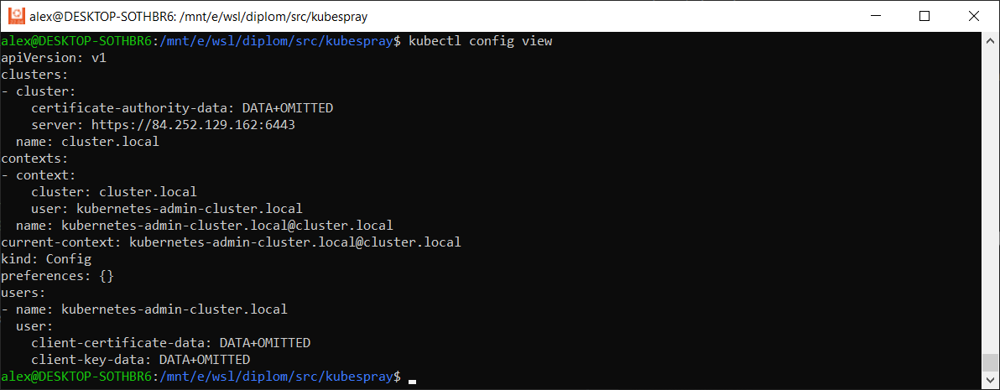

9. Проверяем доступные ноды

```commandline
alex@DESKTOP-SOTHBR6:/mnt/e/wsl/diplom/src/kubespray$ kubectl get nodes
NAME    STATUS   ROLES           AGE   VERSION
node0   Ready    control-plane   29m   v1.29.3
node1   Ready    <none>          28m   v1.29.3
node2   Ready    <none>          28m   v1.29.3
```

10. Проверяем неймспейсы

<details>
<summary> Результат выполнения команды kubectl get all --all-namespaces </summary>

```
alex@DESKTOP-SOTHBR6:/mnt/e/wsl/diplom/src/kubespray$ kubectl get all --all-namespaces
NAMESPACE     NAME                                           READY   STATUS    RESTARTS      AGE
kube-system   pod/calico-kube-controllers-6c7b7dc5d8-l542l   1/1     Running   0             29m
kube-system   pod/calico-node-bk7pz                          1/1     Running   0             31m
kube-system   pod/calico-node-m6lwt                          1/1     Running   0             31m
kube-system   pod/calico-node-qz8lf                          1/1     Running   0             31m
kube-system   pod/coredns-69db55dd76-d5n6r                   1/1     Running   0             28m
kube-system   pod/coredns-69db55dd76-pnt8j                   1/1     Running   0             28m
kube-system   pod/dns-autoscaler-6f4b597d8c-wpfgm            1/1     Running   0             28m
kube-system   pod/kube-apiserver-node0                       1/1     Running   1             32m
kube-system   pod/kube-controller-manager-node0              1/1     Running   3             32m
kube-system   pod/kube-proxy-9476z                           1/1     Running   0             31m
kube-system   pod/kube-proxy-f8t9p                           1/1     Running   0             31m
kube-system   pod/kube-proxy-h88lh                           1/1     Running   0             31m
kube-system   pod/kube-scheduler-node0                       1/1     Running   2 (27m ago)   32m
kube-system   pod/nginx-proxy-node1                          1/1     Running   0             31m
kube-system   pod/nginx-proxy-node2                          1/1     Running   0             31m
kube-system   pod/nodelocaldns-5nz6b                         1/1     Running   0             28m
kube-system   pod/nodelocaldns-qk8xc                         1/1     Running   0             28m
kube-system   pod/nodelocaldns-zhr9l                         1/1     Running   0             28m

NAMESPACE     NAME                 TYPE        CLUSTER-IP   EXTERNAL-IP   PORT(S)                  AGE
default       service/kubernetes   ClusterIP   10.233.0.1   <none>        443/TCP                  32m
kube-system   service/coredns      ClusterIP   10.233.0.3   <none>        53/UDP,53/TCP,9153/TCP   28m

NAMESPACE     NAME                          DESIRED   CURRENT   READY   UP-TO-DATE   AVAILABLE   NODE SELECTOR            AGE
kube-system   daemonset.apps/calico-node    3         3         3       3            3           kubernetes.io/os=linux   31m
kube-system   daemonset.apps/kube-proxy     3         3         3       3            3           kubernetes.io/os=linux   32m
kube-system   daemonset.apps/nodelocaldns   3         3         3       3            3           kubernetes.io/os=linux   28m

NAMESPACE     NAME                                      READY   UP-TO-DATE   AVAILABLE   AGE
kube-system   deployment.apps/calico-kube-controllers   1/1     1            1           29m
kube-system   deployment.apps/coredns                   2/2     2            2           28m
kube-system   deployment.apps/dns-autoscaler            1/1     1            1           28m

NAMESPACE     NAME                                                 DESIRED   CURRENT   READY   AGE
kube-system   replicaset.apps/calico-kube-controllers-6c7b7dc5d8   1         1         1       29m
kube-system   replicaset.apps/coredns-69db55dd76                   2         2         2       28m
kube-system   replicaset.apps/dns-autoscaler-6f4b597d8c            1         1         1       28m
```

</details>

11. Проверяем поды

<details>
<summary> Результат выполнения команды kubectl get pods --all-namespaces </summary>

```
alex@DESKTOP-SOTHBR6:/mnt/e/wsl/diplom/src/kubespray$ kubectl get pods --all-namespaces
NAMESPACE     NAME                                       READY   STATUS    RESTARTS      AGE
kube-system   calico-kube-controllers-6c7b7dc5d8-l542l   1/1     Running   0             34m
kube-system   calico-node-bk7pz                          1/1     Running   0             36m
kube-system   calico-node-m6lwt                          1/1     Running   0             36m
kube-system   calico-node-qz8lf                          1/1     Running   0             36m
kube-system   coredns-69db55dd76-d5n6r                   1/1     Running   0             34m
kube-system   coredns-69db55dd76-pnt8j                   1/1     Running   0             33m
kube-system   dns-autoscaler-6f4b597d8c-wpfgm            1/1     Running   0             34m
kube-system   kube-apiserver-node0                       1/1     Running   1             38m
kube-system   kube-controller-manager-node0              1/1     Running   3             38m
kube-system   kube-proxy-9476z                           1/1     Running   0             37m
kube-system   kube-proxy-f8t9p                           1/1     Running   0             37m
kube-system   kube-proxy-h88lh                           1/1     Running   0             37m
kube-system   kube-scheduler-node0                       1/1     Running   2 (33m ago)   38m
kube-system   nginx-proxy-node1                          1/1     Running   0             37m
kube-system   nginx-proxy-node2                          1/1     Running   0             37m
kube-system   nodelocaldns-5nz6b                         1/1     Running   0             34m
kube-system   nodelocaldns-qk8xc                         1/1     Running   0             34m
kube-system   nodelocaldns-zhr9l                         1/1     Running   0             34m
```

</details>

---
### Создание тестового приложения

Для перехода к следующему этапу необходимо подготовить тестовое приложение, эмулирующее основное приложение разрабатываемое вашей компанией.

Способ подготовки:

1. Рекомендуемый вариант:  
   а. Создайте отдельный git репозиторий с простым nginx конфигом, который будет отдавать статические данные.  
   б. Подготовьте Dockerfile для создания образа приложения.  
2. Альтернативный вариант:  
   а. Используйте любой другой код, главное, чтобы был самостоятельно создан Dockerfile.

Ожидаемый результат:

1. Git репозиторий с тестовым приложением и Dockerfile.
2. Регистри с собранным docker image. В качестве регистри может быть DockerHub или [Yandex Container Registry](https://cloud.yandex.ru/services/container-registry), созданный также с помощью terraform.
---

### Решение

Получил ожидаемый результат:

[Git репозиторий](https://github.com/Alex-Elfman/MyApp) с тестовым приложением и Dockerfile.

В качестве регистра использовал DockerHub. Регистр с собранным [docker image](https://hub.docker.com/layers/alexelfman/myapp/v0.0.1/images/sha256-1d0fa5159b8dc0113fb09b5909aa26f18de08e0c3974604ae59c84f22d4f8402?context=repo).

---
### Подготовка cистемы мониторинга и деплой приложения

Уже должны быть готовы конфигурации для автоматического создания облачной инфраструктуры и поднятия Kubernetes кластера.  
Теперь необходимо подготовить конфигурационные файлы для настройки нашего Kubernetes кластера.

Цель:
1. Задеплоить в кластер [prometheus](https://prometheus.io/), [grafana](https://grafana.com/), [alertmanager](https://github.com/prometheus/alertmanager), [экспортер](https://github.com/prometheus/node_exporter) основных метрик Kubernetes.
2. Задеплоить тестовое приложение, например, [nginx](https://www.nginx.com/) сервер отдающий статическую страницу.

Способ выполнения:
1. Воспользовать пакетом [kube-prometheus](https://github.com/prometheus-operator/kube-prometheus), который уже включает в себя [Kubernetes оператор](https://operatorhub.io/) для [grafana](https://grafana.com/), [prometheus](https://prometheus.io/), [alertmanager](https://github.com/prometheus/alertmanager) и [node_exporter](https://github.com/prometheus/node_exporter). При желании можете собрать все эти приложения отдельно.
2. Для организации конфигурации использовать [qbec](https://qbec.io/), основанный на [jsonnet](https://jsonnet.org/). Обратите внимание на имеющиеся функции для интеграции helm конфигов и [helm charts](https://helm.sh/)
3. Если на первом этапе вы не воспользовались [Terraform Cloud](https://app.terraform.io/), то задеплойте и настройте в кластере [atlantis](https://www.runatlantis.io/) для отслеживания изменений инфраструктуры. Альтернативный вариант 3 задания: вместо Terraform Cloud или atlantis настройте на автоматический запуск и применение конфигурации terraform из вашего git-репозитория в выбранной вами CI-CD системе при любом комите в main ветку. Предоставьте скриншоты работы пайплайна из CI/CD системы.

Ожидаемый результат:
1. Git репозиторий с конфигурационными файлами для настройки Kubernetes.
2. Http доступ к web интерфейсу grafana.
3. Дашборды в grafana отображающие состояние Kubernetes кластера.
4. Http доступ к тестовому приложению.
---

### Решение

Ожидаемый результат:

1. Git репозиторий с конфигурационными файлами для настройки Kubernetes.

Клонировал официальный репозиторий [Kubespray] (https://github.com/kubernetes-sigs/kubespray),
не меняя основной ветки, установил все необходимые приложения (подробно описал в п.4 развертывания кластера).

<details>
<summary> Конфигурация для создания кластера hosts.yaml. </summary>

```
all:
  hosts:
    node0:
      ansible_host: 84.252.129.162
      ansible_user: ubuntu
    node1:
      ansible_host: 84.252.141.29
      ansible_user: ubuntu
    node2:
      ansible_host: 51.250.94.234
      ansible_user: ubuntu
  children:
    kube_control_plane:
      hosts:
        node0:        
    kube_node:
      hosts:        
        node1:
        node2:
    etcd:
      hosts:
        node0:        
    k8s_cluster:
      children:
        kube_control_plane:
        kube_node:
    calico_rr:
      hosts: {}
```
</details>

<details>
<summary> Конфигурация для назначения параметра для подключения через внешний адрес мастера k8s-cluster.yml. </summary>

```
---
# Kubernetes configuration dirs and system namespace.
# Those are where all the additional config stuff goes
# the kubernetes normally puts in /srv/kubernetes.
# This puts them in a sane location and namespace.
# Editing those values will almost surely break something.
kube_config_dir: /etc/kubernetes
kube_script_dir: "{{ bin_dir }}/kubernetes-scripts"
kube_manifest_dir: "{{ kube_config_dir }}/manifests"

# This is where all the cert scripts and certs will be located
kube_cert_dir: "{{ kube_config_dir }}/ssl"

# This is where all of the bearer tokens will be stored
kube_token_dir: "{{ kube_config_dir }}/tokens"

kube_api_anonymous_auth: true

## Change this to use another Kubernetes version, e.g. a current beta release
kube_version: v1.29.3

# Where the binaries will be downloaded.
# Note: ensure that you've enough disk space (about 1G)
local_release_dir: "/tmp/releases"
# Random shifts for retrying failed ops like pushing/downloading
retry_stagger: 5

# This is the user that owns tha cluster installation.
kube_owner: kube

# This is the group that the cert creation scripts chgrp the
# cert files to. Not really changeable...
kube_cert_group: kube-cert

# Cluster Loglevel configuration
kube_log_level: 2

# Directory where credentials will be stored
credentials_dir: "{{ inventory_dir }}/credentials"

## It is possible to activate / deactivate selected authentication methods (oidc, static token auth)
# kube_oidc_auth: false
# kube_token_auth: false


## Variables for OpenID Connect Configuration https://kubernetes.io/docs/admin/authentication/
## To use OpenID you have to deploy additional an OpenID Provider (e.g Dex, Keycloak, ...)

# kube_oidc_url: https:// ...
# kube_oidc_client_id: kubernetes
## Optional settings for OIDC
# kube_oidc_ca_file: "{{ kube_cert_dir }}/ca.pem"
# kube_oidc_username_claim: sub
# kube_oidc_username_prefix: 'oidc:'
# kube_oidc_groups_claim: groups
# kube_oidc_groups_prefix: 'oidc:'

## Variables to control webhook authn/authz
# kube_webhook_token_auth: false
# kube_webhook_token_auth_url: https://...
# kube_webhook_token_auth_url_skip_tls_verify: false

## For webhook authorization, authorization_modes must include Webhook
# kube_webhook_authorization: false
# kube_webhook_authorization_url: https://...
# kube_webhook_authorization_url_skip_tls_verify: false

# Choose network plugin (cilium, calico, kube-ovn, weave or flannel. Use cni for generic cni plugin)
# Can also be set to 'cloud', which lets the cloud provider setup appropriate routing
kube_network_plugin: calico

# Setting multi_networking to true will install Multus: https://github.com/k8snetworkplumbingwg/multus-cni
kube_network_plugin_multus: false

# Kubernetes internal network for services, unused block of space.
kube_service_addresses: 10.233.0.0/18

# internal network. When used, it will assign IP
# addresses from this range to individual pods.
# This network must be unused in your network infrastructure!
kube_pods_subnet: 10.233.64.0/18

# internal network node size allocation (optional). This is the size allocated
# to each node for pod IP address allocation. Note that the number of pods per node is
# also limited by the kubelet_max_pods variable which defaults to 110.
#
# Example:
# Up to 64 nodes and up to 254 or kubelet_max_pods (the lowest of the two) pods per node:
#  - kube_pods_subnet: 10.233.64.0/18
#  - kube_network_node_prefix: 24
#  - kubelet_max_pods: 110
#
# Example:
# Up to 128 nodes and up to 126 or kubelet_max_pods (the lowest of the two) pods per node:
#  - kube_pods_subnet: 10.233.64.0/18
#  - kube_network_node_prefix: 25
#  - kubelet_max_pods: 110
kube_network_node_prefix: 24

# Configure Dual Stack networking (i.e. both IPv4 and IPv6)
enable_dual_stack_networks: false

# Kubernetes internal network for IPv6 services, unused block of space.
# This is only used if enable_dual_stack_networks is set to true
# This provides 4096 IPv6 IPs
kube_service_addresses_ipv6: fd85:ee78:d8a6:8607::1000/116

# Internal network. When used, it will assign IPv6 addresses from this range to individual pods.
# This network must not already be in your network infrastructure!
# This is only used if enable_dual_stack_networks is set to true.
# This provides room for 256 nodes with 254 pods per node.
kube_pods_subnet_ipv6: fd85:ee78:d8a6:8607::1:0000/112

# IPv6 subnet size allocated to each for pods.
# This is only used if enable_dual_stack_networks is set to true
# This provides room for 254 pods per node.
kube_network_node_prefix_ipv6: 120

# The port the API Server will be listening on.
kube_apiserver_ip: "{{ kube_service_addresses | ansible.utils.ipaddr('net') | ansible.utils.ipaddr(1) | ansible.utils.ipaddr('address') }}"
kube_apiserver_port: 6443  # (https)

# Kube-proxy proxyMode configuration.
# Can be ipvs, iptables
kube_proxy_mode: ipvs

# configure arp_ignore and arp_announce to avoid answering ARP queries from kube-ipvs0 interface
# must be set to true for MetalLB, kube-vip(ARP enabled) to work
kube_proxy_strict_arp: false

# A string slice of values which specify the addresses to use for NodePorts.
# Values may be valid IP blocks (e.g. 1.2.3.0/24, 1.2.3.4/32).
# The default empty string slice ([]) means to use all local addresses.
# kube_proxy_nodeport_addresses_cidr is retained for legacy config
kube_proxy_nodeport_addresses: >-
  
  [{{ kube_proxy_nodeport_addresses_cidr }}]
  
  []
  

# If non-empty, will use this string as identification instead of the actual hostname
# kube_override_hostname: >-
#   
#   
#   {{ inventory_hostname }}
#   

## Encrypting Secret Data at Rest
kube_encrypt_secret_data: false

# Graceful Node Shutdown (Kubernetes >= 1.21.0), see https://kubernetes.io/blog/2021/04/21/graceful-node-shutdown-beta/
# kubelet_shutdown_grace_period had to be greater than kubelet_shutdown_grace_period_critical_pods to allow
# non-critical podsa to also terminate gracefully
# kubelet_shutdown_grace_period: 60s
# kubelet_shutdown_grace_period_critical_pods: 20s

# DNS configuration.
# Kubernetes cluster name, also will be used as DNS domain
cluster_name: cluster.local
# Subdomains of DNS domain to be resolved via /etc/resolv.conf for hostnet pods
ndots: 2
# dns_timeout: 2
# dns_attempts: 2
# Custom search domains to be added in addition to the default cluster search domains
# searchdomains:
#   - svc.{{ cluster_name }}
#   - default.svc.{{ cluster_name }}
# Remove default cluster search domains (``default.svc.{{ dns_domain }}, svc.{{ dns_domain }}``).
# remove_default_searchdomains: false
# Can be coredns, coredns_dual, manual or none
dns_mode: coredns
# Set manual server if using a custom cluster DNS server
# manual_dns_server: 10.x.x.x
# Enable nodelocal dns cache
enable_nodelocaldns: true
enable_nodelocaldns_secondary: false
nodelocaldns_ip: 169.254.25.10
nodelocaldns_health_port: 9254
nodelocaldns_second_health_port: 9256
nodelocaldns_bind_metrics_host_ip: false
nodelocaldns_secondary_skew_seconds: 5
# nodelocaldns_external_zones:
# - zones:
#   - example.com
#   - example.io:1053
#   nameservers:
#   - 1.1.1.1
#   - 2.2.2.2
#   cache: 5
# - zones:
#   - https://mycompany.local:4453
#   nameservers:
#   - 192.168.0.53
#   cache: 0
# - zones:
#   - mydomain.tld
#   nameservers:
#   - 10.233.0.3
#   cache: 5
#   rewrite:
#   - name website.tld website.namespace.svc.cluster.local
# Enable k8s_external plugin for CoreDNS
enable_coredns_k8s_external: false
coredns_k8s_external_zone: k8s_external.local
# Enable endpoint_pod_names option for kubernetes plugin
enable_coredns_k8s_endpoint_pod_names: false
# Set forward options for upstream DNS servers in coredns (and nodelocaldns) config
# dns_upstream_forward_extra_opts:
#   policy: sequential
# Apply extra options to coredns kubernetes plugin
# coredns_kubernetes_extra_opts:
#   - 'fallthrough example.local'
# Forward extra domains to the coredns kubernetes plugin
# coredns_kubernetes_extra_domains: ''

# Can be docker_dns, host_resolvconf or none
resolvconf_mode: host_resolvconf
# Deploy netchecker app to verify DNS resolve as an HTTP service
deploy_netchecker: false
# Ip address of the kubernetes skydns service
skydns_server: "{{ kube_service_addresses | ansible.utils.ipaddr('net') | ansible.utils.ipaddr(3) | ansible.utils.ipaddr('address') }}"
skydns_server_secondary: "{{ kube_service_addresses | ansible.utils.ipaddr('net') | ansible.utils.ipaddr(4) | ansible.utils.ipaddr('address') }}"
dns_domain: "{{ cluster_name }}"

## Container runtime
## docker for docker, crio for cri-o and containerd for containerd.
## Default: containerd
container_manager: containerd

# Additional container runtimes
kata_containers_enabled: false

kubeadm_certificate_key: "{{ lookup('password', credentials_dir + '/kubeadm_certificate_key.creds length=64 chars=hexdigits') | lower }}"

# K8s image pull policy (imagePullPolicy)
k8s_image_pull_policy: IfNotPresent

# audit log for kubernetes
kubernetes_audit: false

# define kubelet config dir for dynamic kubelet
# kubelet_config_dir:
default_kubelet_config_dir: "{{ kube_config_dir }}/dynamic_kubelet_dir"

# Make a copy of kubeconfig on the host that runs Ansible in {{ inventory_dir }}/artifacts
# kubeconfig_localhost: false
# Use ansible_host as external api ip when copying over kubeconfig.
# kubeconfig_localhost_ansible_host: false
# Download kubectl onto the host that runs Ansible in {{ bin_dir }}
# kubectl_localhost: false

# A comma separated list of levels of node allocatable enforcement to be enforced by kubelet.
# Acceptable options are 'pods', 'system-reserved', 'kube-reserved' and ''. Default is "".
# kubelet_enforce_node_allocatable: pods

## Set runtime and kubelet cgroups when using systemd as cgroup driver (default)
# kubelet_runtime_cgroups: "/{{ kube_service_cgroups }}/{{ container_manager }}.service"
# kubelet_kubelet_cgroups: "/{{ kube_service_cgroups }}/kubelet.service"

## Set runtime and kubelet cgroups when using cgroupfs as cgroup driver
# kubelet_runtime_cgroups_cgroupfs: "/system.slice/{{ container_manager }}.service"
# kubelet_kubelet_cgroups_cgroupfs: "/system.slice/kubelet.service"

# Optionally reserve this space for kube daemons.
# kube_reserved: false
## Uncomment to override default values
## The following two items need to be set when kube_reserved is true
# kube_reserved_cgroups_for_service_slice: kube.slice
# kube_reserved_cgroups: "/{{ kube_reserved_cgroups_for_service_slice }}"
# kube_memory_reserved: 256Mi
# kube_cpu_reserved: 100m
# kube_ephemeral_storage_reserved: 2Gi
# kube_pid_reserved: "1000"
# Reservation for master hosts
# kube_master_memory_reserved: 512Mi
# kube_master_cpu_reserved: 200m
# kube_master_ephemeral_storage_reserved: 2Gi
# kube_master_pid_reserved: "1000"

## Optionally reserve resources for OS system daemons.
# system_reserved: true
## Uncomment to override default values
## The following two items need to be set when system_reserved is true
# system_reserved_cgroups_for_service_slice: system.slice
# system_reserved_cgroups: "/{{ system_reserved_cgroups_for_service_slice }}"
# system_memory_reserved: 512Mi
# system_cpu_reserved: 500m
# system_ephemeral_storage_reserved: 2Gi
## Reservation for master hosts
# system_master_memory_reserved: 256Mi
# system_master_cpu_reserved: 250m
# system_master_ephemeral_storage_reserved: 2Gi

## Eviction Thresholds to avoid system OOMs
# https://kubernetes.io/docs/tasks/administer-cluster/reserve-compute-resources/#eviction-thresholds
# eviction_hard: {}
# eviction_hard_control_plane: {}

# An alternative flexvolume plugin directory
# kubelet_flexvolumes_plugins_dir: /usr/libexec/kubernetes/kubelet-plugins/volume/exec

## Supplementary addresses that can be added in kubernetes ssl keys.
## That can be useful for example to setup a keepalived virtual IP
supplementary_addresses_in_ssl_keys: [84.252.129.162, 10.10.1.34]

## Running on top of openstack vms with cinder enabled may lead to unschedulable pods due to NoVolumeZoneConflict restriction in kube-scheduler.
## See https://github.com/kubernetes-sigs/kubespray/issues/2141
## Set this variable to true to get rid of this issue
volume_cross_zone_attachment: false
## Add Persistent Volumes Storage Class for corresponding cloud provider (supported: in-tree OpenStack, Cinder CSI,
## AWS EBS CSI, Azure Disk CSI, GCP Persistent Disk CSI)
persistent_volumes_enabled: false

## Container Engine Acceleration
## Enable container acceleration feature, for example use gpu acceleration in containers
# nvidia_accelerator_enabled: true
## Nvidia GPU driver install. Install will by done by a (init) pod running as a daemonset.
## Important: if you use Ubuntu then you should set in all.yml 'docker_storage_options: -s overlay2'
## Array with nvida_gpu_nodes, leave empty or comment if you don't want to install drivers.
## Labels and taints won't be set to nodes if they are not in the array.
# nvidia_gpu_nodes:
#   - kube-gpu-001
# nvidia_driver_version: "384.111"
## flavor can be tesla or gtx
# nvidia_gpu_flavor: gtx
## NVIDIA driver installer images. Change them if you have trouble accessing gcr.io.
# nvidia_driver_install_centos_container: atzedevries/nvidia-centos-driver-installer:2
# nvidia_driver_install_ubuntu_container: gcr.io/google-containers/ubuntu-nvidia-driver-installer@sha256:7df76a0f0a17294e86f691c81de6bbb7c04a1b4b3d4ea4e7e2cccdc42e1f6d63
## NVIDIA GPU device plugin image.
# nvidia_gpu_device_plugin_container: "registry.k8s.io/nvidia-gpu-device-plugin@sha256:0842734032018be107fa2490c98156992911e3e1f2a21e059ff0105b07dd8e9e"

## Support tls min version, Possible values: VersionTLS10, VersionTLS11, VersionTLS12, VersionTLS13.
# tls_min_version: ""

## Support tls cipher suites.
# tls_cipher_suites: {}
#   - TLS_ECDHE_ECDSA_WITH_AES_128_CBC_SHA
#   - TLS_ECDHE_ECDSA_WITH_AES_128_CBC_SHA256
#   - TLS_ECDHE_ECDSA_WITH_AES_128_GCM_SHA256
#   - TLS_ECDHE_ECDSA_WITH_AES_256_CBC_SHA
#   - TLS_ECDHE_ECDSA_WITH_AES_256_GCM_SHA384
#   - TLS_ECDHE_ECDSA_WITH_CHACHA20_POLY1305_SHA256
#   - TLS_ECDHE_ECDSA_WITH_RC4_128_SHA
#   - TLS_ECDHE_RSA_WITH_3DES_EDE_CBC_SHA
#   - TLS_ECDHE_RSA_WITH_AES_128_CBC_SHA
#   - TLS_ECDHE_RSA_WITH_AES_128_CBC_SHA256
#   - TLS_ECDHE_RSA_WITH_AES_128_GCM_SHA256
#   - TLS_ECDHE_RSA_WITH_AES_256_CBC_SHA
#   - TLS_ECDHE_RSA_WITH_AES_256_GCM_SHA384
#   - TLS_ECDHE_RSA_WITH_CHACHA20_POLY1305_SHA256
#   - TLS_ECDHE_RSA_WITH_RC4_128_SHA
#   - TLS_RSA_WITH_3DES_EDE_CBC_SHA
#   - TLS_RSA_WITH_AES_128_CBC_SHA
#   - TLS_RSA_WITH_AES_128_CBC_SHA256
#   - TLS_RSA_WITH_AES_128_GCM_SHA256
#   - TLS_RSA_WITH_AES_256_CBC_SHA
#   - TLS_RSA_WITH_AES_256_GCM_SHA384
#   - TLS_RSA_WITH_RC4_128_SHA

## Amount of time to retain events. (default 1h0m0s)
event_ttl_duration: "1h0m0s"

## Automatically renew K8S control plane certificates on first Monday of each month
auto_renew_certificates: false
# First Monday of each month
# auto_renew_certificates_systemd_calendar: "Mon *-*-1,2,3,4,5,6,7 03:{{ groups['kube_control_plane'].index(inventory_hostname) }}0:00"

# kubeadm patches path
kubeadm_patches:
  enabled: false
  source_dir: "{{ inventory_dir }}/patches"
  dest_dir: "{{ kube_config_dir }}/patches"

# Set to true to remove the role binding to anonymous users created by kubeadm
remove_anonymous_access: false
# Add generate config for access to new cluster  
kubeconfig_localhost: true
```
</details>

2. Http доступ к web интерфейсу grafana.
Кластер [prometheus](https://prometheus.io/), [grafana](https://grafana.com/), [alertmanager](https://github.com/prometheus/alertmanager), [node_exporter](https://github.com/prometheus/node_exporter) основных метрик Kubernetes задеплоил с помощью [helm charts](https://helm.sh/)

По умолчанию не было доступного чарта для helm, для чего выполнил следующие команды:
* helm repo add prometheus-community https://prometheus-community.github.io/helm-charts #добавляем репозиторий
* helm repo update обновляем #репозитории
* Для развертывания в отдельный неймспейс создаем новый `kubectl create namespace monitoring`

<details>
<summary> Деплоим пакеты для мониторинга </summary>

```
alex@DESKTOP-SOTHBR6:/mnt/e/wsl/diplom/stage$ helm install stable prometheus-community/kube-prometheus-stack --namespace=monitoring
NAME: stable
LAST DEPLOYED: Wed Apr 24 19:54:06 2024
NAMESPACE: monitoring
STATUS: deployed
REVISION: 1
NOTES:
kube-prometheus-stack has been installed. Check its status by running:
  kubectl --namespace monitoring get pods -l "release=stable"

Visit https://github.com/prometheus-operator/kube-prometheus for instructions on how to create & configure Alertmanager and Prometheus instances using the Operator.
```
</details>

<details>
<summary> Проверяем поды мониторинга </summary>

```
alex@DESKTOP-SOTHBR6:/mnt/e/wsl/diplom/stage/monitoring$ kubectl --namespace monitoring get pods -l "release=stable"
NAME                                                   READY   STATUS    RESTARTS   AGE
stable-kube-prometheus-sta-operator-6cc67445fb-k5dvj   1/1     Running   0          29m
stable-kube-state-metrics-75bf56f4c8-sdk4f             1/1     Running   0          29m
stable-prometheus-node-exporter-5s68g                  1/1     Running   0          29m
stable-prometheus-node-exporter-9vq6t                  1/1     Running   0          29m
stable-prometheus-node-exporter-bc8pg                  1/1     Running   0          29m
```
</details>

Чтобы подключаться к серверу извне перенастроим сервисы(svc) созданные для kube-prometheus-stack.
По умолчанию используется ClusterIP. Для того чтобы подключиться извне меняем тип порта на NodePort  
Выполняем команду `kubectl edit svc stable-kube-prometheus-sta-prometheus -n monitoring`
Далее меняем значения в конфигурации:
* type: NodePort
* добавляем значение nodePort: 31111 # выбираем любое из диапазона 30000-32767

После чего сохраняем конфигурацию, после чего выйдет сообщение, что настройки успешно изменены.
Далее еще раз выполняем эту же команду, чтобы убедится в принятых изменениях и посмотреть какой порт присвоился.

<details>
<summary> Конфигурация service prometheus </summary>

```commandline
apiVersion: v1
kind: Service
metadata:
  annotations:
    meta.helm.sh/release-name: stable
    meta.helm.sh/release-namespace: monitoring
  creationTimestamp: "2024-04-25T08:28:29Z"
  labels:
    app: kube-prometheus-stack-prometheus
    app.kubernetes.io/instance: stable
    app.kubernetes.io/managed-by: Helm
    app.kubernetes.io/part-of: kube-prometheus-stack
    app.kubernetes.io/version: 58.2.2
    chart: kube-prometheus-stack-58.2.2
    heritage: Helm
    release: stable
    self-monitor: "true"
  name: stable-kube-prometheus-sta-prometheus
  namespace: monitoring
  resourceVersion: "13774"
  uid: ad246d66-6c3d-40ad-a203-6091ef08fe5f
spec:
  clusterIP: 10.233.43.111
  clusterIPs:
  - 10.233.43.111
  externalTrafficPolicy: Cluster
  internalTrafficPolicy: Cluster
  ipFamilies:
  - IPv4
  ipFamilyPolicy: SingleStack
  ports:
  - name: http-web
    nodePort: 30679
    port: 9090
    protocol: TCP
    targetPort: 9090
  - appProtocol: http
    name: reloader-web
    nodePort: 31111
    port: 8080
    protocol: TCP
    targetPort: reloader-web
  selector:
    app.kubernetes.io/name: prometheus
    operator.prometheus.io/name: stable-kube-prometheus-sta-prometheus
  sessionAffinity: None
  type: NodePort
status:
  loadBalancer: {}
```
</details>

<details>
<summary>  Результат вывода </summary>

```commandline
alex@DESKTOP-SOTHBR6:/mnt/e/wsl/diplom/kubespray$ kubectl edit svc stable-kube-prometheus-sta-prometheus -n monitoring
service/stable-kube-prometheus-sta-prometheus edited
```
</details>

Также необходимо сменить доступ к grafana командой `kubectl edit svc stable-grafana -n monitoring` по аналогии с prometheus.

<details>
<summary> Конфигурация service grafana </summary>

```
apiVersion: v1
kind: Service
metadata:
  annotations:
    meta.helm.sh/release-name: stable
    meta.helm.sh/release-namespace: monitoring
  creationTimestamp: "2024-04-25T08:28:29Z"
  labels:
    app.kubernetes.io/instance: stable
    app.kubernetes.io/managed-by: Helm
    app.kubernetes.io/name: grafana
    app.kubernetes.io/version: 10.4.1
    helm.sh/chart: grafana-7.3.9
  name: stable-grafana
  namespace: monitoring
  resourceVersion: "4100"
  uid: ca94b436-68ac-4db6-8a50-a1a8e73cec92
spec:
  clusterIP: 10.233.61.241
  clusterIPs:
  - 10.233.61.241
  internalTrafficPolicy: Cluster
  ipFamilies:
  - IPv4
  ipFamilyPolicy: SingleStack
  ports:
  - name: http-web
    port: 80
    protocol: TCP
    targetPort: 3000
    nodePort: 31112
  selector:
    app.kubernetes.io/instance: stable
    app.kubernetes.io/name: grafana
  sessionAffinity: None
  type: NodePort
status:
  loadBalancer: {}
```
</details>

<details>
<summary> Результат вывода </summary>

```commandline
alex@DESKTOP-SOTHBR6:/mnt/e/wsl/diplom/kubespray$ kubectl edit svc stable-grafana -n monitoring
service/stable-grafana edited
```
</details>

Доступы:
[prometheus](http://158.160.124.94:31111/graph?g0.expr=&g0.tab=1&g0.display_mode=lines&g0.show_exemplars=0&g0.range_input=1h)
[grafana](http://158.160.124.94:31112/login)

3. Дашборды в grafana отображающие состояние Kubernetes кластера.

Prometheus
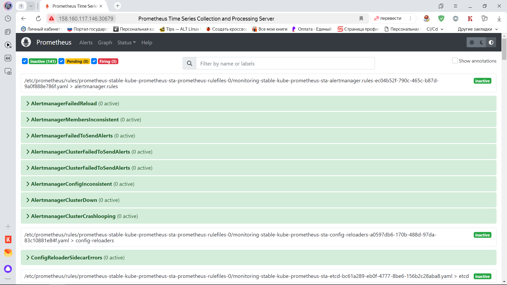

Дашборды в grafana отображающие состояние Kubernetes кластера.
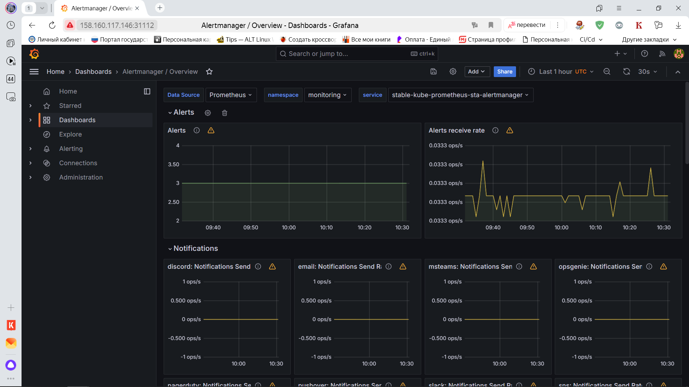

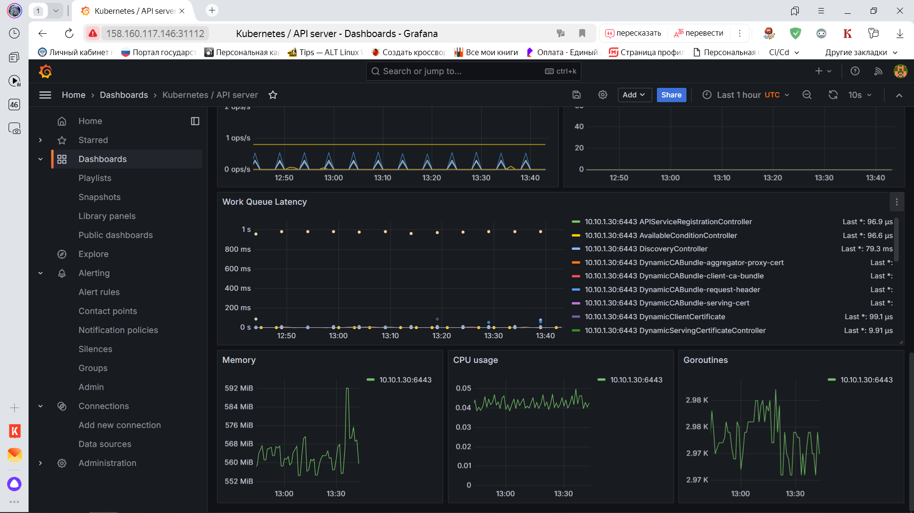

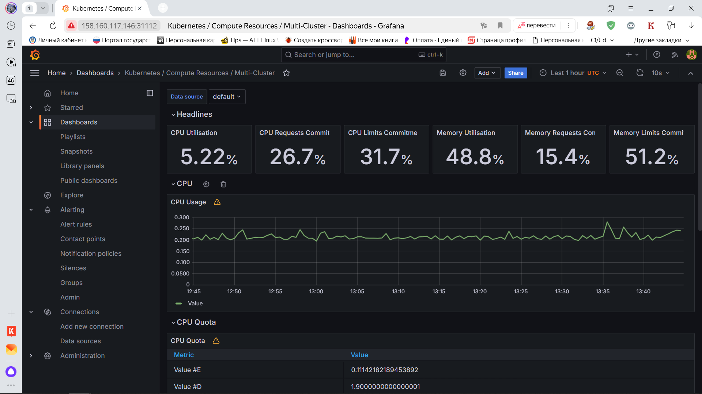

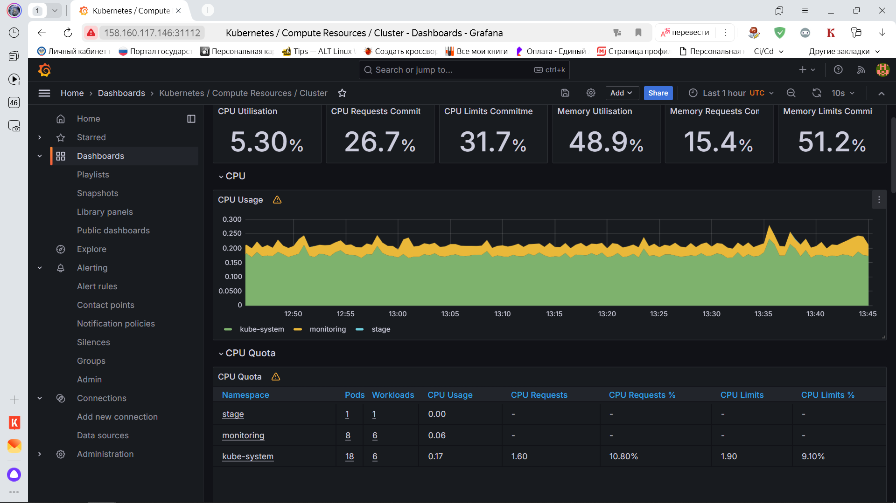

Для доступа используем следующие данные авторизации:
UserName: admin
Password: prom-operator

---
### Установка и настройка CI/CD

Осталось настроить ci/cd систему для автоматической сборки docker image и деплоя приложения при изменении кода.

Цель:

1. Автоматическая сборка docker образа при коммите в репозиторий с тестовым приложением.
2. Автоматический деплой нового docker образа.

Можно использовать [teamcity](https://www.jetbrains.com/ru-ru/teamcity/), [jenkins](https://www.jenkins.io/), [GitLab CI](https://about.gitlab.com/stages-devops-lifecycle/continuous-integration/) или GitHub Actions.

Ожидаемый результат:

1. Интерфейс ci/cd сервиса доступен по http.
2. При любом коммите в репозиторие с тестовым приложением происходит сборка и отправка в регистр Docker образа.
3. При создании тега (например, v1.0.0) происходит сборка и отправка с соответствующим label в регистри, а также деплой соответствующего Docker образа в кластер Kubernetes.
---

### Решение

1. Автоматическая сборка docker образа при коммите в репозиторий с тестовым приложением.

Использовал вариант с GitHub Actions. Для чего проделал следующие действия:
* В [Docker Hub](https://hub.docker.com/settings/security) создал ключ авторизации
* В настроках [репозитория](https://github.com/Alex-Elfman/MyApp/settings/secrets/actions) создал секреты (DOCKER_PASSWORD и DOCKER_USERNAME) для GitHub Actions 
* Авторизовался в Docker Hub `docker login -u alexelfman`, используя ранее созданный ключ

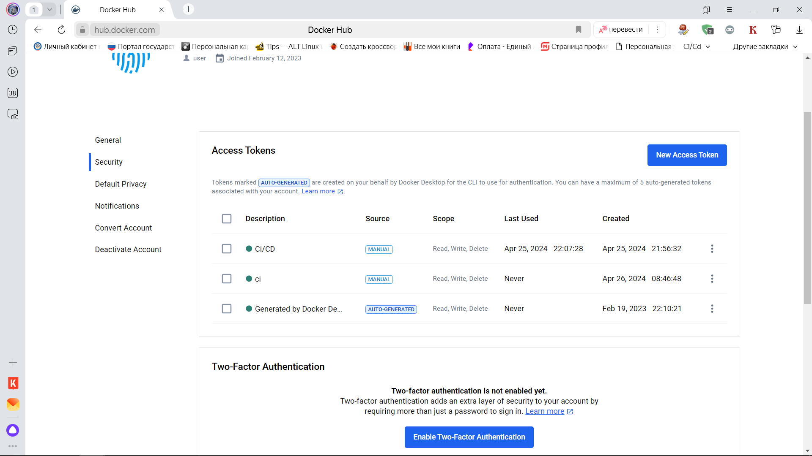
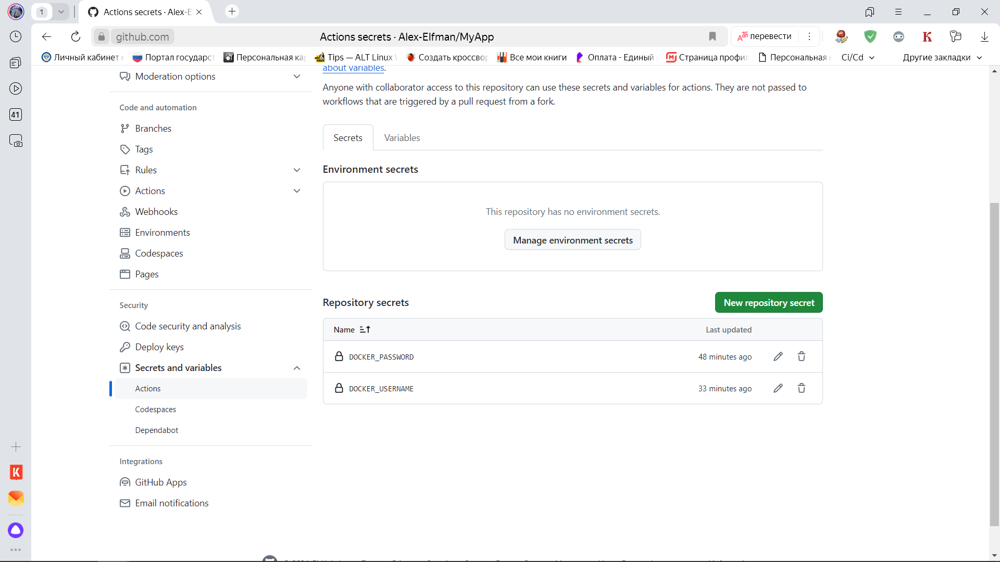

Создал манифест для автосборки. 
p.s.: Путем проб и ошибок в разной комбинации пришел к использованию werf. Под капотом абсолютно все действия, включая создание namespaces и сборку образов.

<details>
<summary> Манифест .github/workflows/docker-publish.yml </summary>

```commandline
name: Deployment
 
on:
  push:
    branches: [ "main" ]
    tags: [ 'v*.*.*' ]
  pull_request:
    branches: [ "main" ]

env:
  REGISTRY: docker.io
  IMAGE_NAME: myapp


jobs:
  build:

    runs-on: ubuntu-latest
    permissions:
      contents: read
      packages: write
      id-token: write

    steps:
      - name: Checkout repository
        uses: actions/checkout@v4
        with:
          fetch-depth: 0

      - name: Install cosign
        uses: sigstore/cosign-installer@v3.5.0
        with:
          cosign-release: 'v2.2.4' # optional

      - name: Setup Docker buildx
        uses: docker/setup-buildx-action@v3
        with:
          version: v0.10.0

      - name: Log in to Docker Hub
        uses: docker/login-action@f4ef78c080cd8ba55a85445d5b36e214a81df20a
        with:
          username: ${{ secrets.DOCKER_USERNAME }}
          password: ${{ secrets.DOCKER_PASSWORD }}

      - name: Extract Docker metadata
        id: meta
        uses: docker/metadata-action@9ec57ed1fcdbf14dcef7dfbe97b2010124a938b7
        with:
          images: ${{ secrets.DOCKER_USERNAME }}/${{ env.IMAGE_NAME }}
          tags: ${{ github.ref_name }}
          labels: latest
          
      - name: Build and push Docker image
        id: build-and-push
        uses: docker/build-push-action@3b5e8027fcad23fda98b2e3ac259d8d67585f671
        with:
          context: . 
          push: true
          tags: ${{ steps.meta.outputs.tags }}
          labels: ${{ steps.meta.outputs.labels }}

      - name: Converge
        uses: werf/actions/converge@v2
        with:
          kube-config-base64-data: ${{ secrets.KUBE_CONFIG_BASE64_DATA }}
```
</details>

<details>
<summary> Итоговый манифест для деплоя myapp\.helm\templates\myapp-deploy.yml </summary>

```commandline
---
apiVersion: apps/v1
kind: Deployment
metadata:
  labels:
    app: app-web
  name: app-web
  namespace: stage
spec:
  replicas: 1
  selector:
    matchLabels:
      app: app-web
  template:
    metadata:
      labels:
        app: app-web
    spec:
      containers:
      - name: app-web   
        image: {{ .Values.werf.image.myapp }}
      terminationGracePeriodSeconds: 30

---
apiVersion: v1
kind: Service
metadata:
  name: app-web
  namespace: stage
spec:
  ports:
    - name: web
      port: 80
      targetPort: 80
      nodePort: 30080
  selector:
    app: app-web
  type: NodePort

```
</details>

<details>
<summary> Манифест werf.yaml </summary>

```commandline
project: stage
configVersion: 1

---
image: myapp
dockerfile: Dockerfile
```
</details>

2. Интерфейс ci/cd сервиса доступен по [http](https://github.com/Alex-Elfman/MyApp/actions/workflows/docker-publish.yml)

3. При любом коммите в репозитории с тестовым приложением происходит сборка и отправка в регистр Docker образа.

Выполняем коммит и пушим в репозиторий на [GitHub](https://github.com/Alex-Elfman/MyApp)
```commandline
alex@DESKTOP-SOTHBR6:/mnt/e/wsl/diplom/myapp$ git add --all && git commit -m "run CI/CD with tag=v1.0.2" && git tag -af v1.0.2 -m "my version app v1.0.2" && git push -f origin v1.0.2
[main ce219fc] run CI/CD with tag=v1.0.2
 1 file changed, 1 insertion(+), 1 deletion(-)
Enumerating objects: 6, done.
Counting objects: 100% (6/6), done.
Delta compression using up to 8 threads
Compressing objects: 100% (4/4), done.
Writing objects: 100% (4/4), 463 bytes | 14.00 KiB/s, done.
Total 4 (delta 2), reused 0 (delta 0), pack-reused 0
remote: Resolving deltas: 100% (2/2), completed with 2 local objects.
To github.com:Alex-Elfman/MyApp.git
 * [new tag]         v1.0.2 -> v1.0.2
```

В результате запустилось [задание](https://github.com/Alex-Elfman/MyApp/actions/runs/8894141953) завершенное [успешно]([](https://github.com/Alex-Elfman/MyApp/actions/workflows/docker-publish.yml))

Проверяем [результат](https://github.com/alex-elfman/MyApp/pkgs/container/myapp%2Fwerf-osipov-app) на GitHub DR

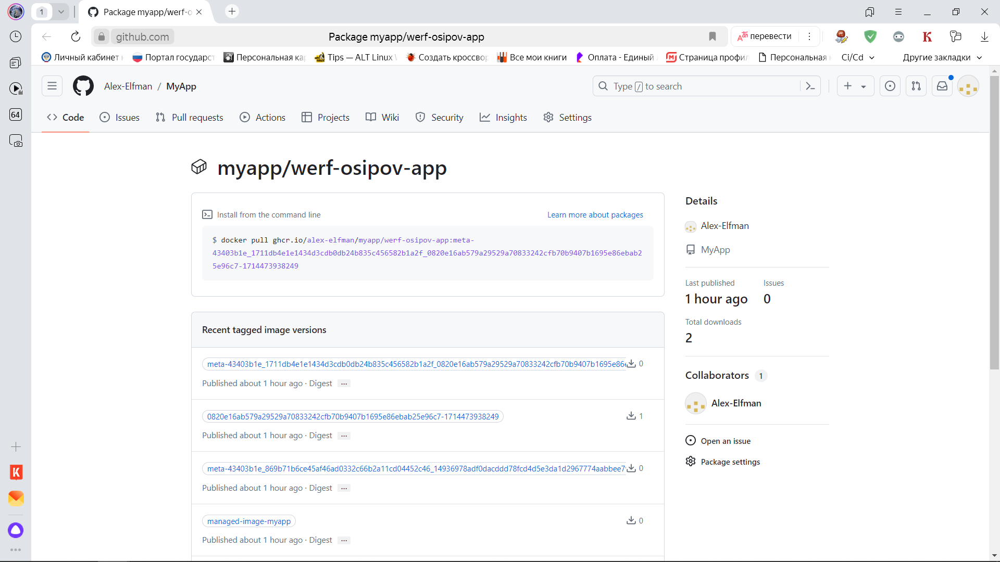

4. При создании тега (например, v1.0.0) происходит сборка и отправка с соответствующим label в регистри, а также деплой соответствующего Docker образа в кластер Kubernetes.

Для того чтобы обеспечить доступ в кластер Kubernetes, информацию из файла конфигурации доступа к кластеру переводим в кодировку base64.
`echo "содержимое файла ~/.kube/config" | base64` получится набор из букв, цифр и символов. Полученное значение добавляем в виде секрета в настройки репозитория в виде переменной KUBE_CONFIG_BASE64_DATA


Добавляем в манифест сборки блок (выше манифест приведен уже с этой задачей)

```commandline
      - name: Deploy
        uses: werf/actions/converge@v2
        with:
          kube-config-base64-data: ${{ secrets.KUBE_CONFIG_BASE64_DATA }}
```

После успешного выполнения задания выходит наше [приложение](http://158.160.80.58:30080//) развернуто в кластере, доступно и смотрим версию

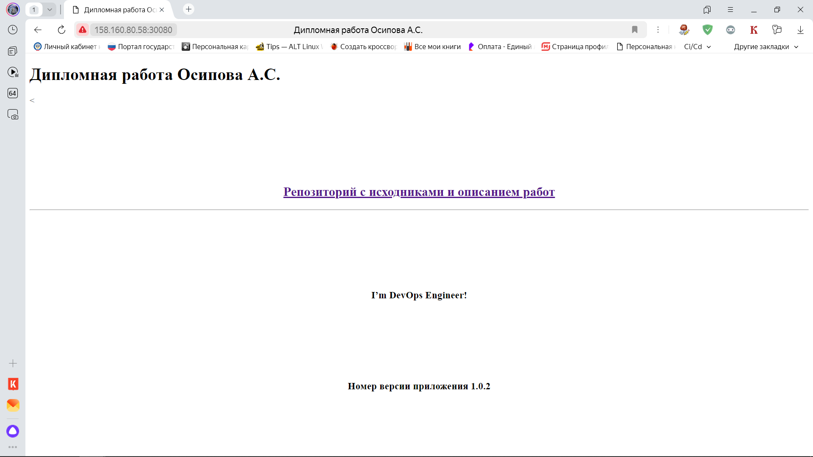

Теперь меняем информацию о версии приложения на странице, добавляем тег 1.0.3.

<details>
<summary> HTML-страница </summary>

```commandline
<!DOCTYPE html>
<html lang="ru">

<head>
<meta charset="UTF-8" name="viewport" content="width=device-width, initial-scale=1">

<title> Дипломная работа Осипова А.С. </title>

</head>

<body>

<h1> Дипломная работа Осипова А.С. </h1>
<hr>
<h2 style="margin-top: 150px; text-align: center;"> <a href="https://github.com/Alex-Elfman/Diplom">Репозиторий с исходниками и описанием работ</a></h2>

<h3 style="margin-top: 150px; text-align: center;"> I’m DevOps Engineer!<h3>

<h3 style="margin-top: 150px; text-align: center;"> Номер версии приложения 1.0.3 <h3>
</body>

</html>
```
</details>

<details>
<summary> Отправка тега 1.0.3 </summary>

```commandline
alex@DESKTOP-SOTHBR6:/mnt/e/wsl/diplom/myapp$ git add --all
alex@DESKTOP-SOTHBR6:/mnt/e/wsl/diplom/myapp$ git commit -m "run CI/CD with tag=v1.0.3"
[main 84a4783] run CI/CD with tag=v1.0.3
 4 files changed, 35 insertions(+), 108 deletions(-)
 rewrite .github/workflows/docker-publish.yml (83%)
alex@DESKTOP-SOTHBR6:/mnt/e/wsl/diplom/myapp$ git tag -af v1.0.3 -m "my version app v1.0.3"
alex@DESKTOP-SOTHBR6:/mnt/e/wsl/diplom/myapp$ git push -f origin v1.0.3
Enumerating objects: 20, done.
Counting objects: 100% (20/20), done.
Delta compression using up to 8 threads
Compressing objects: 100% (7/7), done.
Writing objects: 100% (11/11), 975 bytes | 19.00 KiB/s, done.
Total 11 (delta 4), reused 0 (delta 0), pack-reused 0
remote: Resolving deltas: 100% (4/4), completed with 4 local objects.
To github.com:Alex-Elfman/MyApp.git
 * [new tag]         v1.0.3 -> v1.0.3
```
</details>

Проверяем [образ](https://hub.docker.com/repository/docker/alexelfman/myapp/general) на Docker Hub

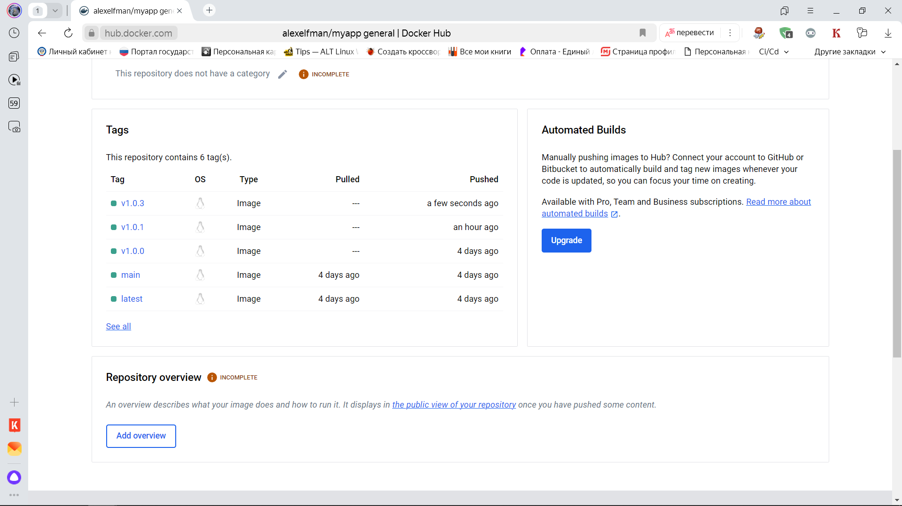

Проверяем [задание](https://github.com/Alex-Elfman/MyApp/actions/runs/8894461237) на GitHub Action

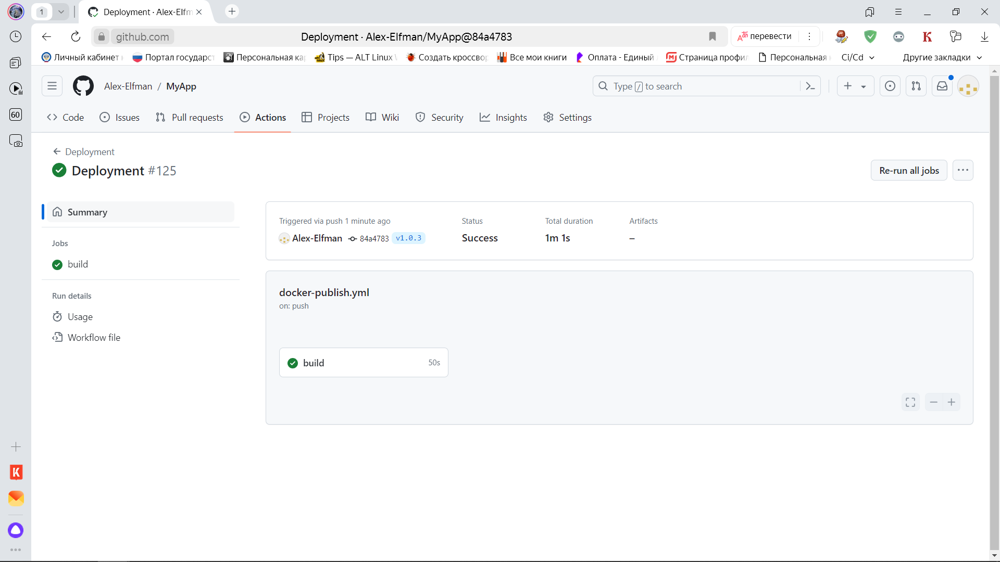

##### Настроил соответствующе .gitignore, чтобы лишние файлы не отправлялись в репозиторий.

### p.s.: Так как используются прерываемые ВМ, инфраструктуру разварачивал раз 6, в среднем длительность стенда в районе суток. При необходимости обновить все ссылки, для проверки, прошу заранее предупредить когда сможете посмотреть. На все про все уйдет около 1 часа.


---
## Что необходимо для сдачи задания?

1. Репозиторий с конфигурационными файлами Terraform и готовность продемонстрировать создание всех ресурсов с нуля.
2. Пример pull request с комментариями созданными atlantis'ом или снимки экрана из Terraform Cloud или вашего CI-CD-terraform pipeline.
3. Репозиторий с конфигурацией ansible, если был выбран способ создания Kubernetes кластера при помощи ansible.
4. Репозиторий с Dockerfile тестового приложения и ссылка на собранный docker image.
5. Репозиторий с конфигурацией Kubernetes кластера.
6. Ссылка на тестовое приложение и веб интерфейс Grafana с данными доступа.
7. Все репозитории рекомендуется хранить на одном ресурсе (github, gitlab)
